## 手写RPC框架项目


`xiong_rpc`：https://github.com/Ding-Jiaxiong/xiong_rpc


### 1. 项目介绍


#### 1.1 介绍


基于`Java`+`Etcd`+`Vert.x`的高性能`RPC`框架，用新颖的技术浅从0到1开发轮子。

可以学习并实践基于`Vert.x`的网络服务器、序列化器、基于`Etcd`和`ZooKeeper`的注册中心、反射、动态代理、`SPI`机制、自定义网络协议、多种设计模式（单例/工厂/装饰者等）、负载均衡器设计、重试和容错机制、`Spring Boot Starter`注解驱动开发等，大幅提升架构设计能力。


#### 1.2 项目特点


该项目是一个侧重技术架构的轮子类项目，区别于增删改查、泛滥的业务系统，学到很多后端架构设计方面的知识技能，比如网络协议设计、注册中心、动态代理和`SPI`机制、多种设计模式、负载均衡、重试，机制、容错机制等等。


#### 1.3 项目收获


- 如何拆解需求，从0开始设计实现RPC框架？
- 如何运用设计模式+`SPI`机制扩展项目？
- 如何更优雅地加载和管理全局配置？
- 如何自定义高性能的RPC协议？
- 如何基于`Vert.x`设计实现TCP服务器和客户端？
- 如何基于Etcd设计高性能的注册中心？
- 如何设计实现负载均衡器，提高系统性能？
- 如何设计实现重试和容错机制，提高系统稳定性？
- 如何基于注解和`Spring Boot Starter`设计项目启动机制？
- 如何从多个角度分析优化项目？
- 此外，还能学会很多作图、思考问题、对比方案的方法，提升排查问题、自主解决Bug的能力。


### 2. 技术选型


###### **后端**


- ☆`Vert.x`框架
- ☆`Etcd`云原生存储中间件(`jetcd`客户端)
- ZooKeeper分布式协调工具(`curator`客户端)
- ☆SPI机制
- ☆多种序列化器
    - JSON序列化
    - Kryo序列化
    - Hessian序列化
- ★多种设计模式
    - 双检锁单例模式
    - 工厂模式
    - 代理模式
    - 装饰者模式
- ☆Spring Boot Starter开发
- ☆负载均衡、重试和容错机制
- ★反射、动态代理和注解驱动
- Guava Retrying重试库
- JUnit单元测试
- Logback日志库
- Hutool、Lombok工具库


### 3. 项目开发流程


#### 3.1 简易版RPC框架开发


##### 3.1.1 基本概念


**什么是RPC**


专业定义：RPC(`Remote Procedure Call`)即远程过程调用，是一种计算机通信协议，它允许程序在不同的计算机之间进行通信和交互，就像本地调用一样。

简单理解，新开了一家卖鱼皮的熟食店，现在你作为消费者想要把鱼皮购买到家。如果是以前，你只自己跑腿到线下店铺购买，耗时耗力。但现在有了手机、网络、外卖平台，你只需要在家动动手指，就肩能点个外卖让骑手把鱼皮配送到家，你不需要关注网络是怎么传输的、外卖平台是怎么操作的、骑手小哥是怎么配送的，只负责享受鱼皮就行了。


**为什么需要RPC**


回到RPC的概念，RPC允许一个程序（称为服务消费者）像调用自己程序的方法一样，调用另一个程序（称为服务提供者）的接口，而不需要了解数据的传输处理过程、底层网络通信的细节等。这些都会由RPC框架帮你完成，使得开发者可以轻松调用远程服务，快速开发分布式系统。

举个例子，现在有个项目A提供了点餐服务，项目B需要调用点餐服务完成下单。

点餐服务和接口的示例伪代码如下：

```java
interface OrderService
	//点餐，返回orderId
	long order(参数1, 参数2, 参数3);
}
```


如果没有RPC框架，项目B怎么调用项目A的服务呢？

首先，由于项目A和项目B都是独立的系统，不像SDK一样作为依赖包引入。那么就需要项目A提供web服务，并且编写一个点餐接口暴露服务，比如访问`http://yupi.icu`就能调用点餐服务；然后项目B作为服务消费者，需要自己构造请求，并通过HttpClient请求上述地址。如果项目B需要调用更多第三方服务，每个服务和方法的调用都编写一个HTTP请求，那么会非常麻烦！


示例伪代码：

```java
url "http://yupi.icu";
req=new Req(参数1, 参数2, 参数3);
res httpclient.post(url).body(req).execute();
orderId = res.data.orderId;
```


而有了RPC框架，项目B可以通过一行代码完成调用！

示例伪代码如下：

```java
orderId = orderService.order(参数1, 参数2, 参数3);
```


看起来就跟调用自己项目的方法没有任何区别！


##### 3.1.2 RPC框架实现思路


**基本设计**


RPC框架为什么能帮我们简化调用？如何实现一个RPC框架呢？


服务消费者和服务提供者

消费者想要调用提供者，就需要提供者启动一个`web`服务，然后通过请求客户端发送HTTP或者其他协议的请求来调用。

比如请求`yupi.icu/order`地址后，提供者会调用`orderService`的`order`方法：


但如果提供者提供了多个服务和方法，每个接口和方法都要单独写一个接口？消费者要针对每个接口写一段`HTTP`调用的逻辑么？

其实可以提供一个统一的服务调用接口，通过请求处理器根据客户端的请求参数来进行不同的处理、调用不同的服务和方法。


→ 可以在服务提供者程序维护一个本地服务注册器，记录服务和对应实现类的映射。


举个例子，消费者要调用`orderService`服务的`order`方法，可以发送请求，参数`services=orderService, method=order`，然后请求处理器会根据`service`从服务注册器中找到对应的服务实现类并且通过`Java`的反射机制调用`method`指定的方法。


需要注意的是，由于Jv对象无法直接在网络中传输，所以要对传输的参数进行序列化和反序列化。


为了简化消费者发请求的代码，实现类似本地调用的体验。可以基于代理模式，为消费者要调用的接口生成一个代理对象，由代理对象完成请求和响应的过程。

所谓代理，就是有人帮你做一些事情，不用自己操心。

至此，一个最简易的RPC框架架构图诞生了：


虚线框部分，就是RPC框架需要提供的模块和能力。


**扩展设计**


1. 服务注册发现


问题1：消费者如何知道提供者的调用地址呢？

类比生活场景，我们点外卖时，外卖小哥如何知道我们的地址和店铺的地址？肯定是买家和卖家分别填写地址，由平台来保存的。因此，我们需要一个注册中心，来保存服务提供者的地址。消费者要调用服务时，只需从注册中心获取对应服务的提供者地址即可。


一般用现成的第三方注册中心，比如Redis、Zookeeper即可。


2. 负载均衡


问题2：如果有多个服务提供者，消费者应该调用哪个服务提供者呢？

我们可以给服务调用方增加负载均衡能力，通过指定不同的算法来决定调用哪一个服务提供者，比如轮询、随机、根据性能动态调用等。

架构图如下：


3. 容错机制


问题3：如果服务调用失败，应该如何处理呢？

为了保证分布式系统的高可用，我们通常会给服务的调用增加一定的容错机制，比如失败重试、降级调用其他接口等等。

架构图如下：


4. 其他


除了上面几个经典设计外，如果想要做一个优秀的RPC框架，还要考虑很多问题。

比如：

- 服务提供者下线了怎么办？需要一个失效节点剔除机制。
- 服务消费者每次都从注册中心拉取信息，性能会不会很差？可以使用缓存来优化性能。
- 如何优化RPC框架的传输通讯性能？比如选择合适的网络框架、自定义协议头、节约传输体积等。
- 如何让整个框架更利于扩展？比如使用Java的`SPI`机制、配置化等等。


##### 3.1.3 开发简易版RPC框架


架构设计图：


###### 项目准备


1. 项目初始化


创建项目根目录：【这里用到的JDK 为 `11`】


再装一个


新建另外四个模块


不要依赖关系


分别介绍几个模块：

- `example_common`:示例代码的公共依赖，包括接口、Model等
- `example_consumer`:示例服务消费者代码
- `example_provider`:示例服务提供者代码
- `xiong_rpc_easy`:简易版RPC框架


2. 公共模块


公共模块需要同时被消费者和服务提供者引入，主要是编写和服务相关的接口和数据模型。


[1] 用户实体类User：


注意，对象需要实现序列化接口，为后续网络传输序列化提供支特。


[2] 用户服务接口`UserService`，提供一个获取用户的方法


3. 服务提供者


服务提供者是真正实现了接口的模块。

[1] 在pom.xml文件中引入依赖：


[2] 编写服务实现类，实现公共模块中定义的用户服务接口。

功能是打印用户的名称，并且返回参数中的用户对象。

代码如下：


[3] 编写服务提供者启动类`EasyProviderExample`,之后会在该类的main方法中编写提供服务的代码。

代码如下：


最终模块目录：


4. 服务消费者


服务消费者是需要调用服务的模块。

[1] 在pom.xml文件中引入依赖，和提供者模块的依赖一致：


[2] 创建服务消费者启动类`EasyConsumerExample`编写调用接口的代码。

代码如下：


需要注意的是，现在是无法获取到`userService`实例的，所以预留为nul。我们之后的目标是，能够通过RPC框架，快速得到一个支持远程调用服务提供者的代理对象，像调用本地方法一样调用`UserService`的方法。

最终得到的该模块目录如下：


###### web服务器


接下来，我们要先让服务提供者提供可远程访问的服务。那么，就需要一个web服务器，能够接受处理请求、并返回响应。

web服务器的选择有很多，比如`Spring Boot`内嵌的`Tomcat`、`NIO`框架`Netty`和`Vert.x`等等。

此处使用高性的`NIO`框架`Vert.x`来作为RPC框架的web服务器。


官方文档：https://vertx.io/


[1] 打开`xiong_rpc_easy`项目，引入`Vert.x`和工具类的依赖：


[2] 编写一个web服务器的接口`HttpServer`,定义统一的启动服务器方法，便于后续的扩展，比如实现多种不同的web服务器。

代码如下：


[3] 编写基于`Vert.x`实现的web服务器`VertxHttpServer`,能够监听指定端口并处理请求。

代码如下：


[4] 验证web服务器能否启动成功并接受请求。

修改示例服务提供者模块的`EasyProviderExample`类，编写启动web服务的代码，如下：


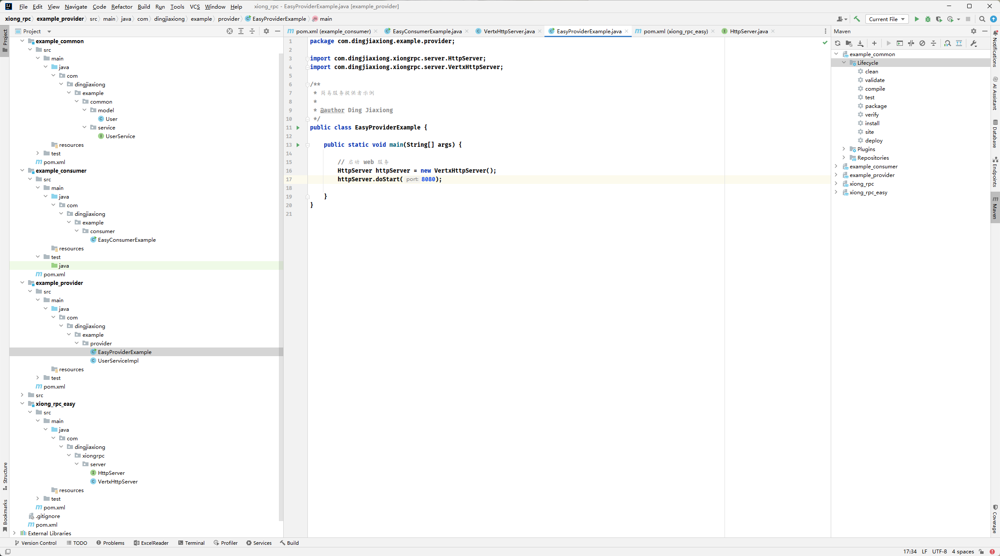


直接运行


访问8080 端口


可以

此时的RPC模块目录结构如下：


###### 本地服务注册器


我们现在故的简易RPC框架主要是跑通流程，所以暂时先不用第三方注册中心，直接把服务注册到服务提供者本地即可。

在RPC模块中创建本地服务注册器`LocalRegistry`,当前目录结构如下：


使用线程安全的`ConcurrentHashMap`存储服务注册信息，key为服务名称、value为服务的实现类。之后就可以根据要调用的服务名称获取到对应的实现类，然后通过反射进行方法调用了。

代码如下：


注意，本地服务注册器和注册中心的作用是有区别的。注册中心的作用侧重于管理注册的服务、提供服务信息给消费者；而本地服务注册器的作用是根据服务名获取到对应的实现类，是完成调用必不可少的模块。

服务提供者启动时，需要注册服务到注册器中，修改`EasyProviderExample`代码如下：


###### 序列化器


服务在本地注册后，我们就可以根据请求信息取出实现类并调用方法了。

但是在编写处理请求的逻辑前，我们要先实现序列化器模块。因为无论是请求或响应，都会涉及参数的传输。而`Java`对象是存活在`JVM`虚拟以机中的，如果想在其他位置存储并访问、或者在网络中进行传输，就需要进行序列化和反序列化。

序例化和反序列化：

- 序列化：将`Java`对象转为可传输的字节数组。
- 反序列化：将字节数组转换为`Java`对象。

有很多种不同的序列化方式，比如`Java`原生序列化、JSON、Hessian、Kryo、protobuf等。

为了实现方便，此处选择`Java`原生的序列化器。

[1] 在RPC模块中编写序列化接口`Serializer`,提供序列化和反序列化两个方法，便于后续扩展更多的序列化器。

代码如下：


[2] 基于`Java`自带的序列化器实现`JdkSerializer`,代码如下：


上面这段代码无需记忆，需要用到的时候照抄即可，关键是要理解序列化和反序列化的区别。

当前RPC模块的目录结构如下：


###### 提供者处理调用 - 请求处理器


请求处理器是RPC框架的实现关键，它的作用是：处理接收到的请求，并根据请求参数找到对应的服务和方法，通过反射实现调用，最后封装返回结果并响应请求。

[1] 在RPC模块中编写请求和响应封装类。

目录结构如下：


请求类`RpcRequest`的作用是封装调用所需的信息，比如服务名称、方法名称、调用参数的类型列表、参数列表。这些都是`Java`反射机制所需的参数。

代码如下：


响应类`RpcResponse`的作用是封装调用方法得到的返回值、以及调用的信息（比如异常情况）等。

代码如下：


[2] 编写请求处理器HttpServerHandler


业务流程如下：

1. 反序列化请求为对象，并从请求对象中获取参数。
2. 根据服务名称从本地注册器中获取到对应的服务实现类。
3. 通过反射机制调用方法，得到返回结果。
4. 对返回结果进行封装和序列化，并写入到响应中。


代码：


需要注意，不同的web服务器对应的请求处理器实现方式也不同，比如`Vert.x`中是通过实现`Handler<HttpServerRequest>`接口来自定义请求处理器的。并且可以通过`request.bodyHandler`异步处理请求。


[3] 给HttpServer绑定请求处理器。

修改`VertxHttpServer`的代码，通过`server.requestHandler`绑定请求处理器。

修改后的代码如下：


至此，引入了RPC框架的服务提供者模块，己经能够接受请求并完成服务调用了。


###### 消费方发起调用 - 代理


这个实现类哪里来，我们可以通过生成代理对象来简化消费方的调用。


**静态代理**


静态代理是指为每一个特定类型的接口或对象，编写一个代理类。

比如在`example_consumer`模块中，创建一个静态代理`UserServiceProxy`,实现`UserService`接口和`getUser`方法。


只不过实现`getUser`方法时，不是复制粘贴服务提供者`UserServicelmpl`中的代码，而是要构造HTTP请求去调用服务提供者。

需要注意发送请求前要将参数序列化，代码如下：


然后修改`EasyConsumerExample`,`new`一个代理对象并赋值给`userService`,就能完成调用：


静态代理虽然很好理解（就是写个实现类），但缺点也很明显，我们如果要给每个服务接口都写一个实现类，是非常麻烦的，这种代理方式的灵活性很差！

所以RPC框架中，我们会使用动态代理。


**动态代理**


动态代理的作用是，根据要生成的对象的类型，自动生成一个代理对象。

常用的动态代理实现方式有`JDK`动态代理和基于字节码生成的动态代理（比如`CGLB`)。前者简单易用、无需引入额外的库，但缺点是只对接口进行代理；后者更灵活、可以对任何类进行代理，但性略低于`JDK`动态代理。
此处我们使用`JDK`动态代理。

[1] 在RPC模块中编写动态代理类ServiceProxy,要实现InvocationHandler接口的invoke方法。

代码如下（几乎就是把静态代理的代码搬运过来）：


解释下上述代码，当用户调用某个接口的方法时，会改为调用`invoke`方法。在`invoke`方法中，我们可以获取到要调用的方法信息、传入的参数列表等，这不就是我们服务提供者需要的参数么？用这些参数来构造请求对象就可以完成调用了。

需要注意的是，上述代码中，请求的服务提供者地址被硬编码了，需要使用注册中心和服务发现机制来解决。


[2] 创建动态代理工厂`ServiceProxyFactory`,作用是根据指定类创建动态代理对象。

目录结构如图：


使用了工厂设计模式，来简化对象的创建过程，代码如下：


上述代码中，主要是通过`Proxy.newProxyInstance`方法为指定类型创建代理对象。


[3] 最后，在`EasyConsumerExample`中，就可以通过调用工厂来为`UserService`获取动态代理对象了。

代码如下：


至此，简易版的RPC框架已经开发完成，下面我们进行测试。


##### 3.1.4 测试验证


[1] 以debug模式启动服务提供者，执行`main`方法：


[2] 以debug模式启动服务消费者，执行main方法。

在`ServiceProxy`代理类中添加断点，可以看到调用userService时，实际是调用了代理对象的`invoke`方法，并且获取到了serviceName、methodName、参数类型和列表等信息。


[3] 继续`debug`,可以看到序列化后的请求对象，结构是字节数组：


[4] 在服务提供者模块的请求处理器中打断点，可以看到接受并反序列化后的请求，跟发送时的内容一致：


[5] 继续`debug`,可以看到在请求处理器中，通过反射成功调用了方法，并得到了返回的User对象。


[6] 最后，在服务提供者和消费者模块中都输出了用户名称，说明整个调用过程成功。


我也不知道说的对不对


#### 3.2 全局配置加载


###### 3.2.1 需求分析


在RPC框架运行的过程中，会涉及到很多的配置信息，比如注册中心的地址、序列化方式、网络服务器端口号等等。

之前的简易版RPC项目中，我们是在程序里硬编码了这些配置，不利于维护。而且RPC框架是需要被其他项目作为服务提供者或者服务消费者引入的，我们应当允许引入框架的项目通过编写配置文件来自定义配置。并且一般情况下，服务提供者和服务消费者需要编写相同的RPC配置。

因此，我们需要一套全局配置加载功能。够让RPC框架轻松地从配置文件中读取配置，并且维护一个全局配置对象，便于框架快速获取到一致的配置。


###### 3.2.2 设计方案


**配置项**


首先我们梳理需要的配置项，刚开始就一切从简，只提供以下几个配置项即可：

- name名称
- version版本号
- serverHost服务器主机名
- serverPort服务器端口号


以下是一些常见的RPC框架配置项，仅做了解即可：

1. 注册中心地址：服务提供者和服务消费者都需要指定注册中心的地址，以便进行服务的注册和发现。
2. 服务接口：服务提供者需要指定提供的服务接口，而服务消费者需要指定要调用的服务接口。
3. 序列化方式：服务提供者和服务消费者都需要指定序列化方式，以便在网络中传输数据时进行序列化和反序列化。
4. 网络通信协议：服务提供者和服务消费者都需要选择合适的网络通信协议，比如TCP、HTTP等。
5. 超时设置：服务提供者和服务消费者都需要设置超时时间，以便在调用服务时进行超时处理。
6. 负载均衡策略：服务消费者需要指定负载均衡策略，以决定调用哪个服务提供者实例。
7. 服务端线程模型：服务提供者需要指定服务端线程模型，以决定如何处理客户端请求。


**读取配置文件**


如何读取配置文件呢？这里可以使用Java的`Properties`类自行编写，但是更推荐使用一些第三方工具库，比如Hutool的Setting模块，可以直接读取指定名称的配置文件中的部分配置信息，并且转换成`Java`对象，非常方便。


一般情况下，我们读取的配置文件名称为`application,properties`,还可以通过指定文件名称后缀的方式来区分多环境，比如`application-prod.properties`表示生产环境、`application-test.properties`表示测试环境。


###### 3.2.3 开发实现


**项目初始化**


[1] 先新建`xiong_rpc_core`模块，后面的RPC项目开发及扩展均在该项目进行。


可以直接复制`easy`


这里直接引入了这个模块，然后改了下模块名


这个artifactid 也改一下啊


[2] 然后给项目引入日志库和单元测试依赖，便于后续开发：


[3] 将`example_consumer`和`example_provider`项目引入的`RPC`依赖都替换成`xiong_rpc_core`代码如下：


**配置加载**


[1] 在config包下新建配置类`RpcConfig`,用于保存配置信息。


可以给属性指定一些默认值，完整代码如下：


[2] 在utils包下新建工具类`ConfigUtils`,作用是读取配置文件并返回配置对象，可以简化调用。

工具类应当尽量通用，和业务不强绑定，提高使用的灵活性。比如支特外层传入要读取的配置内容前缀、支特传入环境等。

完整代码如下：


之后，调用`Configutils`的静态方法就能读取配置了。


[3] 在`constant`包中新建`RpcConstant`接口，用于存储RPC框架相关的常量，

比如默认配置文件的加载前缀为`rpc`：


**维护全局配置对象**


RPC框架中需要维护一个全局的配置对象。在引入RPC框架的项目启动时，从配置文件中读取配置并创建对象实例，之后就可以集中地从这个对象中获取配置信息，而不用每次加载配置时再重新读取配置、并创建新的对象，减少了性开销。

使用设计模式中的单例模式，就能够很轻松地实现这个需求了。

一般情况下，我们会使用`holder`来维护全局配置对象实例。在我们的项目中，可以换一个更优雅的命名，使用`RpcApplication`类作为`RPC`项目的启动入口、并目维护项目全局用到的变量。

完整代码如下：


上述代码其实就是双检锁单例模式的经典实现，支持在获取配置时才调用t方法实现懒加载。

为了便于扩展，还支持自己传入配置对象；如果不传入，则默认调用前面写好的ConfigUtils来加载配置。

以后RPC框架内只需要写一行代码，就能正确加载到配置：


```java
RpcConfig rpc = RpcApplication.getRpcConfig();
```


###### 3.2.4 测试


**测试配置文件读取**


在`example_consumer`项目的`resources`目录下编写配置文件` application.properties `,代码如下：


创建`ConsumerExample`作为扩展后`RPC`项目的示例消费者类，测试配置文件读取。

代码如下：


运行


没写的就用的默认值，能够正确输出配置。


**测试全局配置对象加载**


在`example_provider`项目中创建`ProviderExample`服务提供者示例类，能够根据配置动态地在不同端口启动web服务。


代码如下：


这里好像并没有读到啊，用了默认配置，provider 下也要有个配置文件？当然是我猜测的


###### 3.2.5 扩展


- 支持不同格式配置文件
- 支持监听配置文件更改，并自动更新配置对象
- 配置文件支持中文
- 配置分组


#### 3.3 接口Mock


##### 3.3.1 需求分析


**什么是Mock**


RPC框架的核心功能是调用其他远程服务。但是在实际开发和测试过程中，有时可能无法直接访问真实的远程服务，或者访问真实的远程服务可能会产生不可控的影响，例如网络延迟、服务不稳定等。在这种情况下，就需要使用Mock服务来模拟远程服务的行为，以便进行接口的测试、开发和调试。


Mock是指模拟对象，通常用于测试代码中，特别是在单元测试中，便于我们跑通业务流程。


**为什么要支持Mock**


虽然ock服务并不是RPC框架的核心能力，但是它的开发成本并不高。而且给RPC框架支持Mock后，开发者就可以轻松调用服务接口、跑通业务流程，不必依赖真实的远程服务，提高使用体验，何乐而不为呢？

我们希望能够用最简单的方式一比如一个配置，就让开发者使用m0ck服务。


##### 3.3.2 设计方案


如何创建模拟对象呢？

在RPC项目第一期中，我们就提到了一种动态创建对象的方法一一动态代理。之前是通过动态代理创建远程调用对象。同理，我们通过动态代理创建一个调用方法时返回固定值的对象，不就好了？


##### 3.3.3 开发实现


[1] 我们可以支持开发者通过修改配置文件的方式开启mock,那么首先给全局配置类RpcConfig新增mock字段，默认值为false。

修改的代码如下：


[2] 在Proxy包下新增`MockServiceProxy`类，用于生成mock代理服务。

在这个类中，需要提供一个根据服务接口类型返回固定值的方法。

完整代码如下：


在上述代码中，通过`getDefaultobject`方法，根据代理接口的`class`返回不同的默认值，比如针对boolean类型返回false、对象类型返回`null`等。

[3] ServiceProxyFactory服务代理工厂新增获取mock代理对象的方法getMockProxy。可以通过读取已定义的全局配置 `mock` 来区分创建哪种代理对象。

修改`ServiceProxyFactory`，完整代码如下：


##### 3.3.4 测试


[1] 可以在`example_common`模块的`UserService`中写个具有默认实现的新方法。等下需要调用该方法来测试mock代理服务是否生效，即查看调用的是模拟服务还是真实服务。


代码如下：


[2] 修改示例服务消费者模块中的`application.properties`配置文件，将mock设置为true：


[3] 修改ConsumerExample类，编写调用`userService.getNumber`的测试代码

代码如下：


看到输出的结果值为0，而不是1，说明调用了`MockServiceProxy`模拟服务代理。


如果mock 为false


这样就调用的默认实现的真实服务。


##### 3.3.5 扩展


完善Mock的逻辑，支持更多返回类型的默认值生成。


#### 3.4 序列化器与SPI机制


##### 3.4.1 需求分析


无论是请求或响应，都会涉及参数的传输。而java对象是存活在`JVM`虚拟机中的，如果想在其他位置存储并访问、或者在网络中进行传输，就需要进行序列化和反序列化。


我们还编写了通用的序列化器接口，并且已经实现了基于Java原生序列化的序列化器。但是对于一个完善的RPC框架，我们还要思考以下3个问题：


1. 有没有更好的序列化器实现方式？
2. 如何让使用框架的开发者指定使用的序列化器？
3. 如何让使用框架的开发者自己定制序列化器？


##### 3.4.2 设计方案


###### 1. 序列化器实现方式


我们所追求的“更好的”序列化器，可以是具有高的性能、或者更小的序列化结果，这样就能够更快地完成RP℃的请求和响应。

之前是为了方便，我们使用Java原生序列化实现序列化器，但这未必是最好的。市面上还有很多种主流的序列化方式，比如JSON、Hessian、Kryo、protobuf等。

下面简单列举它们的优缺点：


**主流序列化方式对比**


[1] JSON

优点：

- 易读性好，可读性强，便于人类理解和调试。
- 跨语言支特广泛，几乎所有编程语言都有JSON的解析和生成库。

缺点：

- 序列化后的数据量相对较大，因为JSON使用文本格式存诸数据，需要额外的字符表示键、值和数据结构。
- 不能很好地处理复杂的数据结构和循环引用，可能导致性能下降或者序列化失败。


[2] Hessian：https://hessian.caucho.com/


优点：

- 二进制序列化，序列化后的数据量较小，网络传输效率高。
- 支持跨语言，适用于分布式系统中的服务调用。

缺点：

- 性能较JSON略低，因为需要将对象转换为二进制格式。
- 对象必须实现Serializable接口，限制了可序列化的对象范围。


[3] Kryo：https://github.com/EsotericSoftware/kryo


优点：

- 高性能，序列化和反序列化速度快。
- 支持循环引用和自定义序列化器，适用于复杂的对象结构
- 无需实现Serializable接口，可以序列化任意对象。

缺点：

- 不跨语言，只适用于Java。
- 对象的序列化格式不够友好，不易读懂和调试。


[4] Protobuf


优点：

- 高效的二进制序列化，序列化后的数据量极小。
- 跨语言支持，并目提供了多种语言的实现库。
- 支持版本化和向前/向后兼容性。

缺点：

- 配置相对复杂，需要先定义数据结构的消息格式。
- 对象的序列化格式不易读懂，不便于调试。


###### 2. 动态使用序列化器


之前我们是在代码中硬编码了序列化器，比如：


如果开发者想要替换为别的序列化器，就必须修改所有的上述代码，太麻烦了！

理想情况下，应该可以通过配置文件来指定使用的序列化器。在使用序列化器时，根据居配置来获取不同的序列化器实例即可。

这个操作并不难，我们只需要定义一个`序列化器名称=>序列化器实现类对象`的Map,然后根据名称从Map中获取对象即可。


###### 3. 自定义序列化器

如果开发者不想使用我们框架内置的序列化器，想要自己定义一个新的序列化器实现，但不能修改我们写好的框架代码，应该怎么办呢？

思路很简单：只要我们的RPC框架能狗够读取到用户自定义的类路径，然后加载这个类，作为Serializer序列化器接口的实现即可。

但是如何实现这个操作呢？

这就需要我们学习一个新的概念，也是Java中的重要特性一`SPI`机制。


**什么是SPI?**


SPI(Service Provider Interface)服务提供接口是Java的机制，主要用于实现模块化开发和插件化扩展。

`SPI`机制允许服务提供者通过特定的配置文件将自己的实现注册到系统中，然后系统通过反射机制动态加载这些实现，而不需要修改原始框架的代码，从而实现了系统的解耦、提高了可扩展性。

一个典型的SPI应用场景是JDBC(Uava数据库连接库)，不同的数据库驱动程序开发者可以使用JDBC库，然后定制自己的数据库驱动程序。

此外，我们使用的主流Java开发框架中，几乎都使用到了SPI机制，比如Servlet容器、日志框架、ORM框架、Spring框架。所以这是Java开发者必须掌握的一个重要特性！


**如何实现SPI?**

分为系统实现和自定义实现。


【系统实现】

其实Java内已经提供了SPI机制相关的API接口，可以直接使用，这种方式最简单。


1. 首先在`resources`资源目录下创建`META-INF/services`目录，并且创建一个名称为要实现的接口的空文件。
2. 在文件中填写自己定制的接口实现类的完整类路径
3. 直接使用系统内置的ServiceLoader动态加载指定接口的实现类。


【自定义实现】

系统实现SPI虽然简单，但是如果我们想定制多个不同的接口实现类，就没办法在框架中指定使用哪一个了，也就无法实现我们“通过配置快速指定序列化器”的需求。

所以我们需要自己定义SPI机制的实现，只要能够根据配置加载到类即可。

比如读取如下配置文件，能够得到一个`序列化器名称=>序列化器实现类对象`的映射，之后不就可以根据用户配置的序列化器名称动态加载指定实现类对象了么？


##### 3.4.3 开发实现


###### 1. 多种序列化器实现


我们要分别实现JSON、Kryo和Hessian这三种主流的序列化器。


[1] 首先给项目的pom.xml中引入依赖：


[2] 然后在序列化器包`serializer`中分别实现这三种序列化器，不需要死记硬背。


**JSON序列化器**

JSON序列化器的实现相对复杂，要考虑一些对象转换的兼容性问题，比如Object数组在序列化后会丢失类型

代码如下：


我没有这个类诶


多装了一个这个，就行了


**Kryo序列化器**

Kryo本身是线程不安全的，所以需要使用ThreadLocal保证每个线程有一个单独的Kryo对象实例。

代码如下：


**Hessian序列化器**

实现比较简单，完整代码如下：


###### 2. 动态使用序列化器


以下所有代码均放在`serializer`包下，便于维护和扩展。


[1] 首先定义序列化器名称的常量，使用接口实现。

代码如下：


[2] 定义序列化器工厂。

序列化器对象是可以复用的，没必要每次执行序列化操作前邹创建一个新的对象。所以我们可以使用设计模式中的工厂模式+单例模式来简化创建和获取序列化器对象的操作。

序列化器工厂代码如下，使用Map来维护序列化器实例：


[3] 在全局配置类RpcConfig中补充序列化器的配置，代码如下：


[4] 动态获取序列化器。

需要将之前代码中所有用到序列化器的位置更改为“使用工厂+读取配置”来获取实现类。

要更改的类：

- ServiceProxy
- HttpServerHandler

更改代码如下：


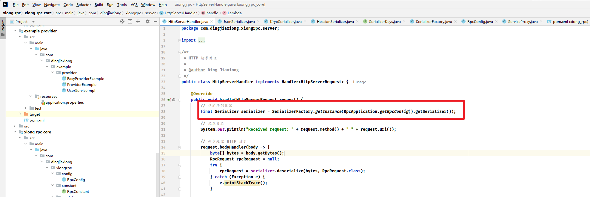


###### 3. 自定义序列化器


我们使用自定义的`SPI`机制实现，支特用户自定义序列化器并指定键名。

[1] 指定SPI配置目录。

系统内置的SPI机制会加载resources资源目录下的META-INF/services目录，那我们自定义的序列化器可以如法炮制，改为读取`META-INF/rpc`目录。

我们还可以将`SPI`配置再分为系统内置SPI和用户自定义SPI,即目录如下：

- 用户自定义`SPI:META-NF/rpc/custom`。用户可以在该目录下新建配置，加载自定义的实现类。
- 系统内置`SPI:META-INF/rpc/system`。RPC框架自带的实现类，比如我们之前开发好的JdkSerializer。

这样一来，所有接口的实现类都可以通过`SPI`动态加载，不用在代码中硬编码Map来维护实现类了。

让我们编写一个系统扩展配置文件，内容为我们之前写好的序列化器。

文件名称为`com.dingjiaxiong.xiongrpc.serializer.Serializer`,如图：


[2] 编写SpiLoader加载器。

相当于一个工具类，提供了读取配置并加载实现类的方法。

关键实现如下：

1. 用Map来存储已加载的配置信息键名=>实现类。
2. 扫描指定路径，读取每个配置文件，获取到键名=>实现类信息并存储在Map中。
3. 定义获取实例方法，根据用户传入的接口和键名，从Map中找到对应的实现类，然后通过反射获取到实现类对象。可以维护一个对象实例缓存，创建过一次的对象从缓存中读取即可。

完整代码如下：


上述代码中，虽然提供了1oad4方法，扫描所有路径下的文件进行加载，但其实没必要使用。更推荐使用Iod方法，按需加载指定的类。

注意，上述代码中获取配置文件是使用了`ResourceUtil.getResources`,而不是通过文件路径获取。因为如果框架作为依赖被引入，是无法得到正确文件路径的。


[3] 重构序列化器工厂

之前，我们是通过在工厂中硬编码HashMap来存储序列化器和实现类的，有了SPI后，就可以改为从SPI加载指定的序列化器对象。

完整代码如下：


使用静态代码块，在工厂首次加载时，就会调用SpiLoader的Ioad方法加载序列化器接口的所有实现类，之后就可以通过调用getlnstance方法获取指定的实现类对象了。


##### 3.4.4 测试


###### 1. SPI加载测试


修改框架custom和system下的SPI配置文件，任意指定键名和实现类路径，验证能否正常加载。

比如下图的配置：


如果key 不存在


key 相同时


key 相同时，自定义配置覆盖系统配置


###### 2. 完整测试


[1] 修改消费者和生产者示例项目中的配置文件，指定不同的序列化器，比如hessian:


提供是json，消费是hessian


运行消费


直接报错了，换成一样的


没问题，换成一样的才能正反成功


###### 3. 自定义序列化器


之后，我们如果要实现自定义的序列化器，只需要进行以下步骤：

1. 写一个类实现Serializer接口
2. 在custom目录下编写`SPI`配置文件，加载自己写的实现类


##### 3.4.5 扩展


- 实现更多不同协议的序列化器
- 序列化器工厂可以使用懒加载（懒汉式单例）的方式创建序列化器实例。
- `SPI Loader`支特懒加载，获取实例时才加载对应的类。


#### 3.5 注册中心基本实现


##### 3.5.1 需求分析


RPC框架的一个核心模块是注册中心，目的是帮助服务消费者获取到服务提供者的调用地址，而不是将调用地址頤编码到项目中。


##### 3.5.2 设计方案


###### 注册中心核心能力


我们先明确注册中心的几个实现关键（核心能力）：

1. 数据分布式存储：集中的注册信息数据存储、读取和共享
2. 服务注册：服务提供者上报服务信息到注册中心
3. 服务发现：服务消费者从注册中心拉取服务信息
4. 心跳检测：定期检查服务提供者的存活状态
5. 服务注销：手动剔除节点、或者自动剔除失效节点
6. 更多优化点：比如注册中心本身的容错、服务消费者缓存等。


###### 技术选型


第一点是最重要的，我们首先需要一个能够集中存储和读取数据的中间件。此外，它还需要有数据过期、数据监听的能力，便于我们移除失效节点、更新节点列表等。

此外，对于注册中心的技术选型，我们还要考虑它的性能、高可用性、高可靠性、稳定性、数据一致性、社区的生态和活跃度等。注册中心的可用性和可靠性尤其重要，因为一旦注册中心本身都挂了，会影响到所有服务的调用。

主流的注册中心实现中间件有ZooKeeper、Redis等。在鱼皮的RPC框架教程中，使用一种更新颖的、更适合存储元信息（注册信息）的云原生中间件`Etcd`,来实现注册中心。


###### Etcd入门


1. **Etcd介绍**

https://github.com/etcd-io/etcd


Etcd是一个Go语言实现的、开源的、分布式的键值存储系统，它主要用于分布式系统中的服务发现、配置管理和分布式锁等场景。

提到Go语言实现，有经验的同学应该就能想到，Etcd的性能是很高的，而且它和云原生有着密切的关系，通常被作为云原生应用的基础设施，存储一些元信息。比如经典的容器管理平台`k8s`就使用了Etcd来存储集群配置信息、状态信息、节点信息等。


意思就是这玩意儿挂了，整个云都得挂


除了性能之外，Etcd采用Raft一致性算法来保证数据的一致性和可靠性，具有高可用性、强一致性、分布式特性等特点。

最可气的是，Etcd还非常简单易用！提供了简单的`API`、数据的过期机制、数据的监听和通知机制等，完美满足注册中心的实现诉求。

Etcd的入门成本是极低的，只要你学过Redis、ZooKeeper或者对象存储中的一个，就能够很快理解Etcd并投入实战运用。我们学知识的一个技巧，就是把新知识和老知识进行类比和关联。


2. **Etcd数据结构与特性**

Etcd的核心数据结构包括：

1. Key(键)：Etcd中的基本数据单元，类似于文件系统中的文件名。每个键都唯一标识一个值，并且可以包含子键，形成类似于路径的层次结构。
2. Value(值)：与键关联的数据，可以是任意类型的数据，通常是字符串形式。


Etcd在其数据模型和组织结构上更接近于ZooKeeper和对象存储，而不是Redis。它使用层次化的键值对来存储数据，支持类似于文件系统路径的层次结构，能够很灵活地单ky查询、按前缀查询、按范围查询。


Etcd有很多核心特性，其中，应用校多的特性是：

1. Lease(租约)：用于对键值对进行TTL超时设置，即设置键值对的过期时间。当租约过期时，相关的键值对将被自动删除。

2. Watch(监听)：可以监视特定键的变化，当键的值发生变化时，会触发相应的通知。


有了这些特性，我们就能够实现注册中心的服务提供者节点过期和监听了。


3. **Etcd如何保持数据一致性**


从表层来看，Etcd支持事务操作，能够保证数据一致性。

从底层来看，Etcd使用Raft一致性算法来保证数据的一致性。

Raft是一种分布式一致性算法，它确保了分布式系统中的所有节点在任何时间点都能达成一致的数据视图。


具体来说，Raft算法通过选举机制选举出一个领导者(Leader)节点，领导者负责接收客户端的写请求，并将写操作复制到其他节点上。当客户端发送写请求时，领导者首先将写操作写入自己的日志中，并将写操作的日志条目分发给其他节点，其他节点收到日志后也将其写入自己的日志中。一旦大多数节点（即半数以上的节点）都将该日志条目成功写入到自己的日志中，该日志条目就被视为已提交，领导者会向客户端发送成功响应。在领导者发送成功响应后，该写操作就被视为已提交，从而保证了数据的一致性。

如果领导者节点宕机或失去联系，Rt算法会在其他节点中选举出新的领导者，从而保证系统的可用性和一致性。新的领导者会继续接收客户端的写请求，并负责将写操作复制到其他节点上，从而保特数据的一致性。


理解Playground：http://play.etcd.io/play


4. **Etcd基本操作**


和所有数据存储中间件一样，基本操作无非就是：增删改查。


5. **Etcd安装**


官方下载页：https://github.com/etcd-io/etcd/releases or https://etcd.io/docs/v3.2/install/


试试这个


- etcd:etcd服务本身
- etcdctl:客户端，用于操作etcd,比如读写数据


启动一下：


服务默认占用2379和2380端口，作用分别如下：

- 2379：提供HTTP API服务，和etcdctr交互
- 2380：集群中节点之间通讯


6. **Etcd可视化工具**


etcdkeeper：https://github.com/evildecay/etcdkeeper/
kstone:https://github.com/kstone-io/kstone/tree/master/charts


试试这个


8081 启动，访问一下


没问题


7. **Etcd Java 客户端**


所谓客户端，就是操作Etcd的工具。

etcd主流的Java客户端是 jetcd: https://github.com/etcd-io/jetcd


注意，Java版本必须大于11！

用法非常简单，就像curator能够操作ZooKeeper、jedis能够操作Redis一样。


[1] 加入依赖


[2] 按照官方文档的示例写Demo:


这时的可视化工具


在上述代码中，我们使用KVClient来操作etcd写入和读取数据。除了KVClient客户端外，Etcd还提供了很多其他客户端。


常用的客户端和作用如下，仅作了解即可：

1. kvClient:用于对etcd中的键值对进行操作。通过kvClient可以进行设置值、获取值、删除值、列出目录等操作。
2. leaseClient:用于管理etcd的租约机制。租约是etcd中的一种时间片，用于为键值对分配生存时间，并在租约到期时自动删除相关的键值对。通过leaseClient可以创建、获取、续约和撤销租约。
3. watchClient:用于监视etcd中键的变化，并在键的值发生变化时接收通知。
4. clusterClient:用于与etcd集群进行交互，包括添加、移除、列出成员、设置选举、获取集群的健康状态、获取成员列表信息等操作！
5. authClient::用于管理etcd的身份验证和授权。通过authClient可以添加、删除、列出用户、角色等身份信息，以及授予或撤销用户或角色的权限。
6. maintenanceClient:用于执行etcd的维护操作，如健康检查、数据库备份、成员维护、数据库快照、数据库压缩等。
7. lockClient:用于实现分布式锁功能，通过lockClient可以在etcd上创建、获取、释放锁，能够轻松实现并发控制。
8. electionClient:用于实现分布式选举功能，可以在etcd上创建选举、提交选票、监视选举结果等。


绝大多数情况下，用前3个客户端就足够了。


[3] Etcd 的数据结构：


发现除了key和vlue外，还能看到版本、创建版本、修改版本字段。这是因为etcd中的每个键都有一个与之关联的版本号，用于跟踪键的修改历史。当一个键的值发生变化时，其版本号也会增加。【和zookeeper 那啥，我有点忘了，之前学过一个中间件也是这样】

通过使用etcd的Watch API,可以监视键的变化，并在发生变化时接收通知。这种版本机制使得etcd在分布式系统中能够实现乐观并发控制、一致性和可靠性的数据访问


###### 存储结构设计


存储结构设计的几个要点：

1. key如何设计？
2. value如何设计？
3. key什么时候过期？

由于一个服务可能有多个服务提供者（负载均衡），我们可以有两种结构设计：


[1] 层级结构。将服务理解为文件夹、将服务对应的多个节点理解为文件夹下的文件，那么可以通过服务名称，用前缀查询的方式查询到某个服务的所有节点。


如图，键名的规则可以是 `业务前缀/服务名/服务节点地址`


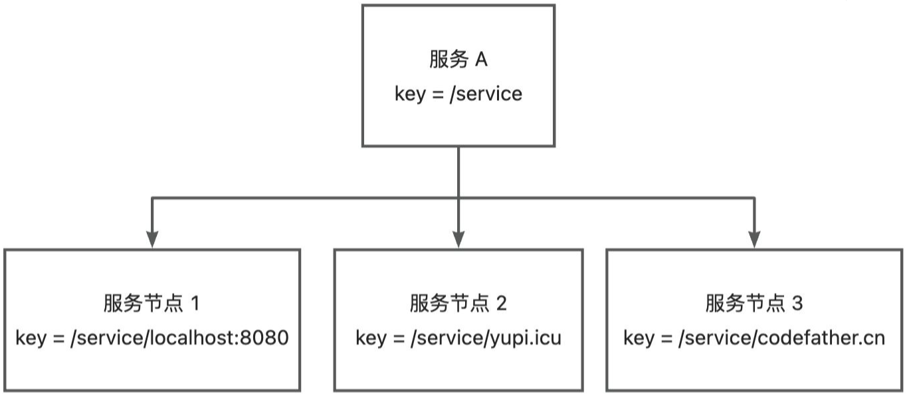


[2] 列表结构。将所有的服务节点以列表的形式整体作为value。


选择哪种存储结构呢？这个也会跟我们的技术选型有关。对于ZooKeeper和Etcd这种支持层级查询的中间件，**用第一种结构**会更清晰；对于Rdis,由于本身就支持列表数据结构，可以选择第二种结构。

最后，一定要给key设置过期时间，比如默认30秒过期，这样如果服务提供者宕机了，也可以超时后自动移除。


##### 3.5.3 开发实现


###### 1. 注册中心开发


[1] 注册信息定义。

在model包下新建ServiceMetaInfo类，封装服务的注册信息，包括服务名称、服务版本号、服务地址（域名和端口号）、服务分组等。


需要给ServiceMetaInfo增加一些工具方法，用于获取服务注册键名、获取服务注册节点键名等。

可以把版本号和分组邹放到服务键名中，就可以在查询时根据这些参数获取对应版本和分组的服务了。

代码如下：


由于注册信息里包含了服务版本号字段，所以我们也可以给RpcRequest对象补充服务版本号字段，可以先作为预留字段，默认值为"1.0"，后续再自行实现。

在RpcConstant常量类中补充默认服务版本常量：


在RpcRequest请求类中使用该常量，代码如下：


[2] 注册中心配置


在config包下编写注册中心配置类`RegistryConfig`,让用户配置连接注册中心所需的信息，比如注册中心类别、注册中心地址、用户名、密码、连接超时时间等。

代码如下：


还要为RpcConfig全局配置补充注册中心配置，代码如下：


[3] 注册中心接口

遵循可扩展设计，我们先写一个注册中心接口，后续可以实现多种不同的注册中心，并且和序列化器一样，可以使用`SPI`机制动态加载。

注册中心接口代码如下，主要是提供了初始化、注册服务、注销服务、服务发现（获取服务节点列表）、服务销毁等方法。


[4] Etcd 注册中心实现


在registry目录下新建EtcdRegistry类，实现注册中心接口，先完成初始化方法，读取注册中心配置并初始化客户端对象。

代码如下：【之前我们那个测试不就是这个文件】


上述代码中，我们定义Etcd键存储的根路径为`/rpc/`,为了区分不同的项目。

依次实现不同的方法，首先是服务注册，创建key并设置过期时间，value为服务注册信息的JSON序列化。代码如下：


然后是服务注销，删除key：


然后是服务发现，根据服务名称作为前缀，从EtCd获取服务下的节点列表：


最后是注册中心销毁，用于项目关闭后释放资源：


注册中心实现类的完整代码如下：


###### 2. 支持配置和扩展注册中心


一个成熟的RPC框架可能会支特多个注册中心，像序列化器一样，我们的需求是，让开发者够填写配置来指定使用的注册中心，并且支特自定义注册中心，让上框架更易用、更利于扩展。

要实现这点，开发方式和序列化器也是一样的，都可以使用工厂创建对象、使用`SPI`动态加载自定义的注册中心。


[1] 注册中心常量

在registry包下新建RegistryKeys类，列举所有支持的注册中心键名。


[2] 使用工厂模式，支特根据key从`SPI`获取注册中心对象实例。

在registry包下新建RegistryFactory类，代码如下：


这个类可以直接复制之前的SerializerFactory,然后略做修改。


[3] 在META-INF的rpc/system目录下编写注册中心接口的SPI配置文件，文件名称为


[4] 最后，我们需要一个位置来初始化注册中心。由于服务提供者和服务消费者都需要和注册中心建立连接，是一个RPC框架启动必不可少的环节，所以可以将初始化流程放在RpcApplication类中。


修改其  init  方法代码如下：


###### 3. 完成调用流程


下面我们要改造服务消费者调用服务的代码，跑通整个动态获取节点并调用的流程。


[1] 服务消费者需要先从注册中心获取节点信息，再得到调用地址并执行。


需要给 ServiceMetaInfo类增加一个方法，便于获取可调用的地址，代码如下：


[2] 修改服务代理ServiceProxy类，更改调用逻辑。

修改的部分代码如下：


注意，从注册中心获取到的服务节点地址可能是多个。

ServiceProxy 的完整代码如下：


##### 3.5.4 测试


###### 1. 注册中心测试


首先验证注册中心香正常完成服务注册、注销、服务发现。

编写单元测试类RegistryTest,代码如下：


可以发现key列表是树形展示的，因为Etcd是层级结构，很清晰。


###### 2. 完整流程测试


在example-provider模块下新增服务提供者示例类，需要初始化RPC框架并且将服务手动注册到注册中心上。

代码如下：


启动


可视化


没问题，注册上去了

启动消费者


消费者报错了，没找到


不对，有一个过期时间，刚刚是过期了，这次快一点


这次过了。6


##### 3.5.5 扩展


#### 3.6 注册中心优化


##### 3.6.1 需求分析


我们基于Etcd完成了基础的注册中心，够注册和获取服务和节点信息。

但目前系统仅仅是处于可用的程度，还有很多需要解决的问题和可优化点：

1. 数据一致性：服务提供者如果下线了，注册中心需要即时更新，剔除下线节点。否测消费者可能会调用到已经下线的节点。
2. 性能优化：服务消费者每次都需要从注册中心获取服务，可以使用缓存进行优化。
3. 高可用性：保证注册中心本身不会宕机。
4. 可扩展性：实现更多其他种类的注册中心。


##### 3.6.2 注册中心优化


###### 心跳检测和续期机制


**心跳检测介绍**


心跳检测（俗称heartBeat)是一种用于监测系统是否正常工作的机制。它通过定期发送心跳信号（请求）来检测目标系统的状态。

如果接收方在一定时间内没有收到心跳信号或者未正常响应请求，就会认为目标系统故障或不可用，从而触发相应的处理或告警机制。

心跳检测的应用场景非常广泛，尤其是在分布式、微服务系统中，比如集群管理、服务健康检查等。

>  我们怎么检测自己做的web后端是否正常运行呢？一个最简单的方法，就是写一个心跳检测接口。然后我们只需要执行一个脚本，定期调用这个接口，如果调用失败，就知道系统故障了。


**方案设计**


[1] 从心跳检测的概念来看，实现心跳检测一般需要2个关键：定时、网络请求。

但是使用Etcd实现心跳检测会更简单一些，因为Etcd自带了ky过期机制，我们不妨换个思路：给节点注册信息一个"生命倒计时”，让节点定期续期，重置自己的倒计时。如果节点已宕机，一直不续期，Etcd就会对key进行过期删除。

**一句话总结：到时间还不续期就是寄了**。

在Etcd中，我们要实现心跳检测和续期机制，可以遵循如下步骤：

1. 服务提供者向Etcd注册自己的服务信息，并在注册时设置TTL(生存时间)。
2. tcd在接收到服务提供者的注册信息后，会自动维护服务信息的TTL,并在TTL过期时删除该服务信息。
3. 服务提供者定期请求Etcd续签自己的注册信息，重写TTL。

需要注意的是，续期时间一定要小于过期时间，允许一次容错的机会。


[2] 每个服务提供者都需要找到自己注册的节点、续期自己的节点，但问题是，怎么找到当前服务提供者项目自己的节点呢？

那就充分利用本地的特性，在服务提供者本地维护一个已注册节点集合，注册时添加节点key到集合中，只需要续期集合内的key即可。


**开发实现**


[1] 给注册中心Registry接口补充心跳检测方法，代码如下：


[2] 维护续期节点集合。

定义一个本机注册的节点key集合，用于维护续期：


在服务注册时，需要将节点添加到集合中，代码如下：


同理，在服务注销时，也要从集合中移除对应节点：


[3] 在EtcdRegistry中实现heartBeat方法。

可以使用Hutool工具类的CronUtil实现定时任务，对所有集合中的节点执行重新注册操作，这是一个小tick,就相当于续签了。

心跳检测方法的代码如下：


采用这种实现方案的好处是，即时Ecd注册中心的数据出现了丢失，通过心跳检测机制也会重新注册节点信息。

[4] 开启heartBeat
在注册中心初始化的init方法中，调用heartBeat方法即可。

代码如下：


**测试**

完善之前的RegistryTest单元测试代码：


使用可视化工具观察节点底部的过期时间，当TTL到20左右的时候，又会重置为30，说明心跳检测和续期机制正常执行。


这看哪儿啊，啊这


这里这里，再来一次


不对，没实现，直接30秒死掉了


哦哦，是运行这个，这个里面会调注册，再试一次


实现了的，来个动图


###### 服务节点下线机制


当服务提供者节点宕机时，应该从注册中心移除掉已注册的节点，否则会影响消费端调用。所以我们需要设计一套服务节点下线机制。


**方案设计**


服务节点下线又分为：

- 主动下线：服务提供者项目正常退出时，主动从注册中心移除注册信息。
- 被动下线：服务提供者项目异常推出时，利用Etcd的key过期机制自动移除。

被动下线已经可以利用Etcd的机制实现了，我们主要开发主动下线。
问题是，怎么在Java项目正常退出时，执行某个操作呢？
其实，非常简单，利用VM的ShutdownHook就能实现。
JVM的ShutdownHook是Java虚拟机提供的一种机制，允许开发者在JVM即将关闭，之前执行一些清理工作或其他必要的操作，例如关闭数据库连接、释放资源、保存临时数据等。

Spring Boot也提供了类似的优雅停机能力。


**开发实现**


[1] 完善Etcd注册中心的destroy方法，补充下线节点的逻辑。

代码如下：


[2] 在RpcApplication的init方法中，注册`Shutdown Hook`,当程序正常退出时会执行注册中心的destroy方法。

代码如下：


**测试**


测试方法很简单：

1. 启动服务提供者，然后观察服务是否成功被注册

   

   

   注册成功，心跳检测也在执行

2. 正常停止服务提供者，然后观察服务信息是否被删除

   

   

   没问题


###### 消费端服务缓存


正常情况下，服务节点信息列表的更新频率是不高的，所以在服务消费者从注册中心获取到服务节点信息列表后，完全可以缓存在本地，下次就不用再请求注册中心获取了，够提高性能。


1. **增加本地缓存**


本地缓存的实现很简单，用一个列表来存储服务信息即可，提供操作列表的基本方法，包括：写缓存、读缓存、清空缓存。

在registry包下新增缓存类RegistryServiceCache,代码如下：


2. **使用本地缓存**


[1] 修改EtcdRegisty的代码，使用本地缓存对象：


[2] 修改服务发现逻辑，优先从缓存获取服务；如果没有缓存，再从注册中心获取，并且设置到缓存中。

代码如下：


3. **服务缓存更新** - 监听机制


当服务注册信息发生变更（比如节点下线）时，需要即时更新消费端缓存。

问题是，怎么知道服务注册信息什么时候发生变更呢？

这就需要我们使用Etcd的watch监听机制，当监听的某个key发生修改或删除时，就会触发事件来通知监听者。
如图：


码垛

什么时候去创建watch监听器呢？

我们首先要明确watch监听是服务消费者还是服务提供者执行的。由于我们的目标是更新缓存，缓存是在服务消费端维护和使用的，所以也应该是服务消费端去watch。

也就是说，只有服务消费者执行的方法中，可以创建watch监听器，那么比较合适的位置就是服务发现方法(serviceDiscovery)。可以对本次获取到的所有服务节点key进行监听。

还需要防止重复监听同一个key,可以通过定义一个已监听key的集合来实现。

下面我们来开发编码。。

[1] Registry注册中心接口补充监听key的方法，代码如下：


[2] EtcdRegistry类中，新增监听key的集合。

可以使用ConcurrentHashSet防止并发冲突，代码如下：


[3] 在EtcdRegistry类中实现监听key的方法。

通过调用Etcd的Watchclient实现监听，如果出现了`DELETE` key删除事件，则清理服务注册缓存。

注意，即使ky在注册中心被删除后再重新设置，之前的监听依旧生效。所以我们只监听首次加入到监听集合的key,防止重复。

代码如下：


[4] 在消费端获取服务时调用watch方法，对获取到的服务节点key进行监听。

修改服务发现方法的代码如下：


[5] 测试


这里我加了个日志


可以使用如下步骤，通过debug进行测试：

1. 先启动服务提供者

   

2. 修改服务消费者项目，连续调用服务3次，通过debug可以发现，第一次查注册中心、第二次查询缓存。

   

   

   第一次

   

   好像没生效啊

   哦，应该要刷一下

3. 在第三次要调用服务时，下线服务提供者，可以在注册中心看到节点的注册key已被删除。

4. 继续向下执行，发现第三次调用服务时，又重新从注册中心查询，说明缓存已经被更新。


哦哦哦，发现问题了，没有写入服务缓存


再试一次


没问题，


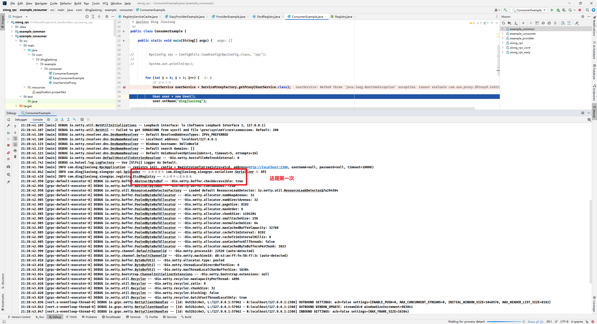


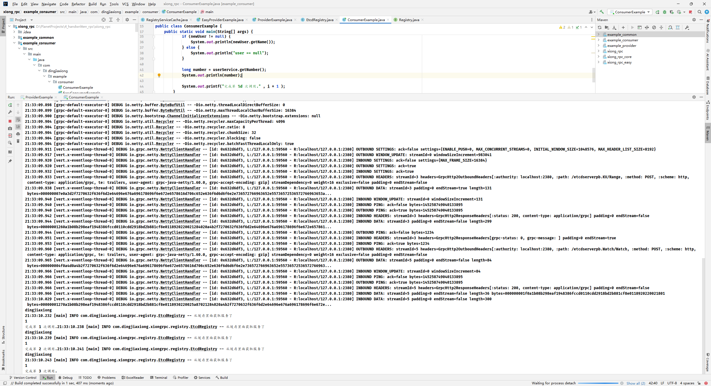


这样就清晰了，其实调用输出数字那个方法的时候，已经是从缓存里面拿了，打印名字的时候已经放入缓存了。


至此，消费端服务缓存功已经完成。


###### Zookeeper注册中心实现


其实和Etcd注册中心的实现方式极其相似，步聚如下：

1. 安装ZooKeeper

2. 引入客户端依赖
3. 实现接口
4. SPl补充ZooKeeper注册中心


[1] 本地下载并启动ZooKeeper,教程使用的版本是3.8.4 。


正常启动ZooKeeper后，默认会占用几个端口号，比如2181（客户端）、8080（管理端）等。


这个要改下配置文件，因为默认是Linux 版本的


主要是这个


还要改个名字


，启动看看


这样就起来了


[2] 引入客户端依赖

一般我们会使用Apache Curator来操作ZooKeeper

引入的依赖代码如下：


[3] ZooKeeper注册中心实现，这里不再赘述


[4] SPl增加对ZooKeeper的支持：


[5] 最后，可以更改服务提供者和消费者的注册中心配置来测试。


更改配置


试试

启动服务者


好，但是端口就要改一下，8080 已经被 zookeeper 占用了


重来


9999 启动成功，服务消费者调用


服务调用成功，这次用的是zookeeper ，


再试一次，明显一些


没问题。【之后还是用 etcd】


##### 3.6.3 扩展


- 完善服务注册信息
- 实现更多注册中心
- 保证注册中心的高可用
- 服务注册信息失效的兜底策略
- 注册中心key 监听时，采用观察者模式实现处理


#### 3.7 自定义协议


##### 3.7.1 需求分析


目前的RPC框架，我们使用`Vert.x`的`HttpServer`作为服务提供者的服务器，代码实现比较简单，其底层网络传输使用的是HTTP协议。

HTTP只是RPC框架网络传输的一种可选方式罢了。

问题来了，使用HTTP协议会有什么问题么？或者说，有没有更好的选择？

一般情况下，RPC框架会比较注重性能，而HTTP协议中的头部信息、请求响应格式较"“重”，会影响网络传输性能。


所以，我们需要自己自定义一套RPC协议，比如利用TCP等传输层协议、自己定义请求响应结构，来实现性能更高、更灵活、更安全的RPC框架。


> 蛙趣


##### 3.7.2 设计方案


自定义RPC协议可以分为2大核心部分：

- 自定义网络传输
- 自定义消息结构


###### 1. 网络传输设计


网络传输设计的目标是：选择一个够高性通信的网络协议和传输方式。

需求分析中已经提到了，HTTP协议的头信息是比较大的，会影响传输性能。但其实除了这点外，HTTP本身属于无状态协议，这意味着每个HTTP请求都是独立的，每次请求/响应都要重新建立和关闭连接，也会影响性能。

考虑到这点，在HTTP/1.1中引入了持久连接(Keep-Alive)，允许在单个TCP连接上发送多个HTTP请求和响应，避免了每次请求都要重新建立和关闭连接的开销。

虽然如此，HTTP本身是应用层协议，我们现在设计的RPC协议也是应用层协议，性能肯定是不如底层（传输层）的TCP协议要高的。所以我们想要追求更高的性能，还是选择使用TCP协议完成网络传输，有更多的自主设计
空间。


###### 2. 消息结构设计


消息结构设计的目标是：用最少的空间传递需要的信息。


消息结构设计的目标是：用最少的空间传递需要的信息。

[1] 如何使用最少的空间呢？

大家之前接触到的数据类型可者都是整型、长整型、浮点数类型等等，这些类型其实都比较“重”，占用的字节数较多。比如整型要占用4个字节、32个bit位。

我们在自定义消息结构时，想要节省空间，就要尽可能使用更轻量的类型，比如byt字节类型，只占用1个字节、8个bit位。
需要注意的是，Java中实现bit位运算拼接相对比较麻烦，所以权衡开发成本，我们设计消息结构时，尽量给每个数据凑到整个字节。


[2] 消息内需要哪些信息呢？

目标肯定是能够完成请求

分析HTTP请求结构，我们能够得到RPC消息所需的信息：

- 魔数：作用是安全校验，防止服务器处理了非框架发来的乱七八槽的消息（类似HTTPS的安全证书）
- 版本号：保证请求和响应的一致性（类以HTTP协议有1.0/2.0等版本）
- 序列化方式：来告诉服务端和客户端如何解析数据（类似HTTP的Content-Type内容类型）
- 类型：标识是请求还是响应？或者是心跳检测等其他用途。（类似HTTP有请求头和响应头）
- 状态：如果是响应，记录响应的结果（类似HTTP的200状态代码）

此外，还需要有请求d,唯一标识某个请求，因为TCP是双向通信的，需要有个唯一标识来追踪每个请求。

最后，也是最重要的，要发送body内容数据。我们暂时称它为请求体，类似于我们之前HTTP请求中发送的RpcRequest。

如果是HTTP这种协议，有专门的key/vlue结构，很容易找到完整的body数据。但基于TCP协议，想要获取到完整的body内容数据，就需要一些"小心思”了，因为TCP协议本身会存在半包和粘包问题，每次传输的数据
可能是不完整的，具体的后面会讲。

所以我们需要在消息头中新增一个字段`请求体数据长度`，保证能够完整地获取b0dy内容信息。


基于以上的思考，我们可以得到最终的消息结构设计，如下图：


实际上，这些数据应该是紧凑的，请求头信息总长17个字节。也就是说，上述消息结构，本质上就是拼接在一起的一个字节数组。我们后续实现时，需要有消息编码器和消息解码器，编码器先nw一个空的Buffer缓冲区，然后按照顺序向缓冲区依次写入这些数据：解码器在读取时也按照顺序依次读取，就还原出编码前的数据。

通过这种约定的方式，我们就不用记录头信息了。比如magic魔数，不用存储"magic”这个字符串，而是读取第一个字节（前8bit)就能获取到。

如果你学过Redis底层，会发现很多数据结构都是这种设计。

如果大家是第一次设计协议，或者经验不足，强烈建议大家先去学一下优秀开源框架的协议设计，这样不会说毫无头绪。

比如鱼皮就参考了Dubbo的协议设计，如下图：


> 我何德何能，设计协议


明确了设计后，我们来开发实现，就比较简单了。


##### 3.7.3 开发实现


###### 1. 消息结构


新建protocol包，将所有和自定义协议有关的代码都放到该包下。


[1] 新建协议消息类ProtocolMessage。

将消息头单独封装为一个内部类，消息体可以使用泛型类型，完整代码如下：


[2] 新建协议常量类ProtocolConstant。

记录了和自定义协议有关的关键信息，比如消息头长度、魔数、版本号。

完整代码如下：


[3] 新建消息字段的枚举类，比如：

协议状态枚举，暂时只定义成功、请求失败、响应失败三种枚举值：


协议消息类型枚举，包括请求、响应、心跳、其他。代码如下：


协议消息的序列化器枚举，跟我们RPC框架已支持的序列化器对应。代码如下：


###### 2. 网络传输


我们的RPC框架使用了高性能的`Vert.x`作为网络传输服务器，之前用的是HttpServer。同样，Vert.x也支特TCP服务器，相比于Netty或者自己写Socket代码，更加简单易用。

首先新建server.tcp包，将所有TCP服务相关的代码放到该包中。

[1] TCP服务器实现。

新建`VertxTcpServer`类，跟之前写的VertxHttpServer类以，先创建`Vert.x`的服务器实例，然后定义处理请求的方法，比如回复"Hello,client!",最后启动服务器。

示例代码如下：


上述代码中的`socket.write`方法，就是在向连接到服务器的客户瑞发送数据。注意发送的数据格式为Buffer,这是`Vert.x`为我们提供的字节数组缓冲区实现。


[2] TCP 客户端实现

新建`VertxTcpclient`类，先创建`Vert.x`的客户端实例，然后定义处理请求的方法，比如回复"Hello,server!!”,并建立连接。

示例代码如下：


[3] 可以先进行简单的测试，先启动服务器，再启动客户端，够在控制台看到它们互相打招呼的输出。


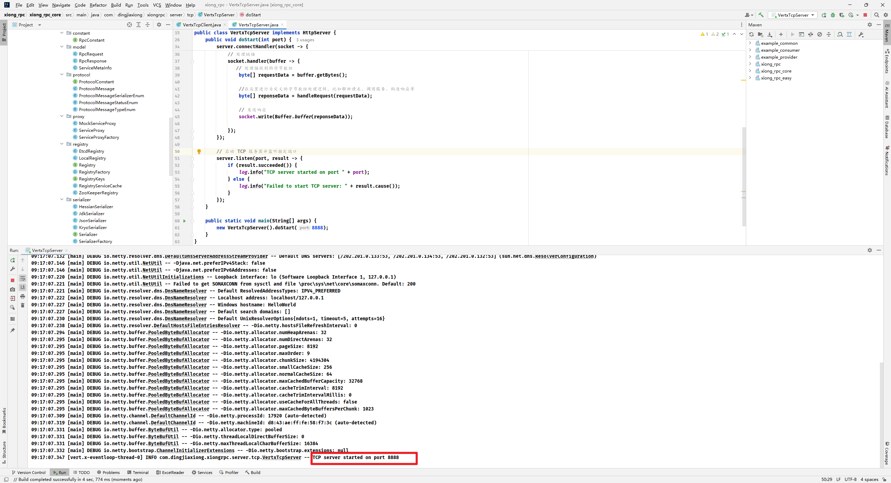


服务端没有输出


这里是实现的接口，再来一次


不对，服务端根本没有打印：


再来一次


OK


###### 3. 编码 / 解码器


在上一步中，我们也注意到了，Vert.x的TCP服务器收发的消息是Buffer类型，不能直接写入一个对象。因此，我们需要编码器和解码器，将Java的消息对象和Bufr进行相互转换。

鱼皮只用一张图，通过演示整个请求和响应的过程，相信就能带大家了解编码器和解码器的作用。


之前HTTP请求和响应时，直接从请求body处理器中获取到body字节数组，再通过序列化（反序列化）得到RpcRequest或RpcResponse对象。使用TCP服务器后，只不过改为从Buffer中获取字节数组，然后编解码为RpcRequest或RpcResponse对象。其他的后续处理流程都是可复用的。


[1] 首先实现消息编码器。

在protocol包下新建ProtocolMessageEncoder,核心流程是依次向Buffer缓冲区写入消息对象里的字段。

代码如下：


[2] 实现消息解码器。

在protocol包下新建ProtocolMessageDecoder,核心流程是依次从Buffer缓冲区的指定位置读取字段，构造出完整的消息对象，

代码如下：


[3] 编写单元测试类，先编码再解码，以测试编码器和解码器的正确性。

代码如下：


###### 4. 请求处理器（服务提供者）


可以使用netty的pipeline组合多个handler(比如编码=>解码=>请求/响应处理)

请求处理器的作用是接受请求，然后通过反射调用服务实现类。

类似之前的HttpServerHandler,我们需要开发一个TcpServerHandler,用于处理请求。和HttpServerHandler的区别只是在获取请求、写入响应的方式上，需要调用上面开发好的编码器和解码器。

通过实现`Vert.x`提供的`Handler<NetSocket>`:接口，可以定义TCP请求处理器。

完整代码如下，大多数代码都是从之前写好的HttpServerHandler复制来的：


###### 5. 请求发送（服务消费者）


调整服务消费者发送请求的代码，改HTTP请求为TCP请求。

代码如下：


这里的代码看着比较复杂，但只需要关注上述代码中注释了“发送TCP请求”的部分即可。由于`Vert.x`提供的请求处理器是异步、反应式的，我们为了更方便地获取结果，可以使用`CompletableFuture`转异步为同
步，参考代码如下：


##### 3.7.4 测试


编写好上述代码后，我们就可以先测试请求响应流程是否跑通了。


将VertxTcpServer类的doStart方法中`NetServer.connectHandler()`方法的入参改为TcpServerHandler类的实例【感谢鱼友】


修改服务提供者`ProviderExample`代码，改为启动TCP服务器。完整代码如下：


这一直在抛异常


启动消费者也一直在抛童颜更多问题。


哦哦哦，配置文件忘记改了，他在尝试链接zookeeper 服务，其实我本地没启动


消费者也要改


再试一次


TCP 服务启动完成


没问题。三次调用完成。


> 如果上面那个地方不改
>
> 
>
> 服务也能正常启动
>
> 
>
> 但是magic 就非法了


然后启动消费者示例项目，应该够正常完成调用。如果不能，那可能就是出现了我们接下来要讲的问题一粘包半包问题。


##### 3.7.5 粘包半包问题解决


###### 什么是粘包和半包？

使用TCP协议网络通讯时，可能会出现半包和粘包问题。

我举个例子大家就明白了。

理想情况下，假如我们客户端连续2次要发送的消息是：


但服务端收到的消息情况可是：

[1] 每次收到的数据更少了，这种情况叫做半包：


[2] 每次收到的数据更多了，这种情况叫做粘包：


###### 半包粘包问题演示


为了更好地理解半包和粘包，我们可以编写代码来测试。


[1] 修改TCP客户端代码，连续发送1000次消息：


[2] 修改TCP服务端代码，打印出每次收到的消息：


运行

[3] 测试运行，查看服务端控制台，发现服务端接受消息时，出现了半包和粘包：


我这儿居然没有半包 ...


###### 如何解决半包？


解决半包的核心思路是：在消息头中设置请求体的长度，服务端接收时，判断每次消息的长度是否符合预期，不完整就不读，留到下一次接收到消息时再读取。

示例代码如下：


###### 如何解决粘包？

解决粘包的核心思路也是类以的：每次只读取指定长度的数据，超过长度的留着下一次接收到消息时再读取。

示例代码如下：


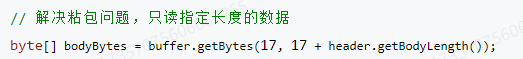


听上去简单，但自己实现起来还是比较麻烦的，要记录每次接收到的消息位置，维护字节数组缓存。


###### Vert.x解决半包和粘包


在`Vert.x`框架中，可以使用内置的RecordParser完美解决半包粘包，它的作用是：保证下次读取到特定长度的字符。
先不要急着直接修改业务代码，而是先学会孩类库的使用，跑通测试流程，再引入到自己的业务代码中。


**基础代码**


[1] 先小试牛刀，使用RecordParser来读取固定长度的消息，

示例代码如下：


上述代码的核心是RecordParser.newFixed(messageLength),为Parser指定每次读取固定值长度的内容。
测试，发现，这次的输出结果非常整齐，解决了半包和粘包：


[2] 实际运用中，消息体的长度是不固定的，所以要通过调整RecordParser的固定长度（变长）来解决。

那我们的思路可以是，将读取完整的消息拆分为2次：

1. 先完整读取请求头信息，由于请求头信息长度是固定的，可以使用RecordParser保证每次都完整读取。
2. 再根据请求头长度信息更改RecordParser的固定长度，保证完整获取到请求体。


修改测试TCP Server代码如下：


修改测试TCP client代码如下，自己构造了一个变长、长度信息不在Buffer最开头（而是有一定偏移量）的消息：


测试结果应该也是能够正常读取到消息的，不会出现半包和粘包。


**封装半包粘包处理器**


我们会发现，解决半包粘包，问题还是有一定的代码量的，而且由于ServiceProxy(消费者)和请求Handler(提供者)都需要接受Buffer,所以都需要半包粘包问题处理。

那我们就应该要想到：需要对代码进行封装复用了。

这里我们可以使用设计模式中的装饰者模式，使用RecordParser对原有的Buffer处理器的能力进行增强。

装饰者模式可以简单理解为给对象穿装备，增强对象的能力。

在server.tcp包下新建TcpBufferHandlerWrapper类，实现并增强`Handler<Buffer>`接口。
完整代码如下：


其实就是把RecordParser的代码粘了过来，当调用处理器的handle方法时，改为调用recordParser.handle。


###### 优化客户端调用代码


有了半包粘包处理器，我们就可以很轻松地在业务代码中运用它了。

[1] 修改TCP请求处理器。

使用TcpBufferHandlerWrapper来封装之前处理请求的代码，请求逻辑不用变，要修改的部分代码如下：


其实就是使用一个Wrapper对象包装了之前的代码，就解决了半包粘包。是不是很简单？这就是装饰者模式的妙用！

现在的AI不就是这样么？给你个AI工具，你就能做到之前很多想都不敢想的事情。


[2] 修改客户端处理响应的代码。


之前我们是把所有发送请求、处理响应的代码都写到了ServiceProxy中，使得这个类的代码“臃肿不堪”。

我们干脆做个优化，把所有的请求响应逻辑提取出来，封装为单独的VertxTcpClient类，放在server.tcp包下。

VertxTcpClient的完整代码如下：


注意，上述代码中，也使用了TcpBufferHandlerWrapper对处理响应的代码进行了封装。

修改ServiceProxy代码，调用VertxTcpClient,修改后的代码如下：


测试一下


消费者那边不能这样写


看到了，提供者启动在8888 ，消费者去请求的8080


再来一次


这下是在8888 端口，启动消费者


三次调用完成，说明整体代码逻辑没有受到影响


##### 3.7.6 扩展


- 自己定义一个占用空间更少的RPC 协议的消息结构


##### 最后


最后再给大家抛个小问题：为什么tcpServer不提供个server接口，或者和httpServer共用接口？

鱼皮的想法是这样的：替换这两个服务器（协议实现）涉及的改动点非常多，比如RPC协议、请求处理器等，不是直接通过配置就替换的，而且RPC框架一般也不需要替换底层的协议，只使用TCP会更好。


#### 3.8 负载均衡


##### 3.8.1 需求分析


现在我们的RPC框架已经可以从注册中心获取到服务提供者的注册信息了，同一个服务可能会有多个服务提供者，但是目前我们消费者始终读取了第一个服务提供者节点发起调用，不仅会增大单个节点的压力而且没有利用好其他节点的资源。

我们完全可以从服务提供者节点中，选择一个服务提供者发起请求，而不是每次都请求同一个服务提供者，这个操作就叫做负载均衡。


##### 3.8.2 负载均衡


###### 什么是负载均衡


让我们把这个词拆开来看：

- 何为负载？可以把负载理解为要处理的工作和压力，比如网络请求、事务、数据处理任务等。
- 何为均衡？把工作和压力平均地分配给多个工作者，从而分难每个工作者的压力，保证大家正常工作。

用个比喻，假设餐厅里只有一个服务员，如果顾客非常多，他可能会忙不过来，没法及时上菜莱、忙中生乱；而且他的压力会越来越大，最严重的情况下就累倒了无法继续工作。而如果有多个服务员，大家能够服务更多的顾客，即使有一个服务员生病了，其他服务员也能帮忙顶上。

所以，负载均衡是一种用来分配网络或计算负载到多个资源上的技术。它的目的是确保每个资源都够有效地处理负载、增加系统的并发量、避免某些资源过载而导致性能下降或服务不可用的情况。

回归到我们的RPC框架，负载均衡的作用是从一组可用的服务提供者中选择一个进行调用。

常用的负载均衡实现技术有Ngiⅸ（七层负载均衡）、LVS(四层负载均衡)等。


###### 常见负载均衡算法


负载均衡学习的重点就是它的算法一按照什么策略选泽资源。

不同的负载均衡算法，适用的场景也不同，一定要根据实际情况选取，主流的负载均衡算法如下：

- 轮询(Round Robin)：按照循环的顺序将请求分配给每个服务器，适用于各服务器性能相近的情况。
- 随机(Random)：随机选择一个服务器来处理请求，适用于服务器性能相近且负载均匀的情况。
- 加权轮询(Weighted Round Robin)：根据服务器的性能或权重分配请求，性能更好的服务器会获得更多的请求，适用于服务器性能不均的情况。
- 加权随机(Weighted Random)：根据服务器的权重随机选择一个服务器处理请求，适用于服务器性能不均的情况。
- 最小连接数(Least Connections):选择当前连接数最少的服务器来处理请求，适用于长连接场景。
- IP Hash:根据客户端P地址的哈希值选怿服务器处理请求，确保同一客户瑞的请求始终被分配到同一台服务器上，适用于需要保特会话一致性的场景。


###### 一致性Hash


一致性哈希(Consistent Hashing)是一种经典的哈希算法，用于将请求分配到多个节点或服务器上，所以非常适用于负载均衡。

它的核心思想是将整个哈希值空间划分成一个环状结构，每个节点或服务器在环上占据一个位置，每个请求根据其哈希值映射到环上的一个点，然后顺时针寻找第一个大于或等于该哈希值的节点，将请求路由到该节点上。

一致性哈希环结构如图：


上图中，请求A会交给服务器C来处理。

好像也没什么特别的啊？还整个环？

其实，一致性哈希还解决了节点下线和倾斜问题。


【1】节点下线：当某个节点下线时，其负载会被平均分傩到其他节点上，而不会影响到整个系统的稳定性，因为只有部分请求会受到影响。

如下图，服务器C下线后，请求A会交给服务器A来处理（顺时针寻找第一个大于或等于该哈希值的节点），而服务器B接收到的请求保特不变。


如果是轮询取模算法，只要节点数变了，很有可能大多数服务器处理的请求者都要发生变化，对系统的影响巨大。

【2】倾斜问题：通过虚拟节点的引入，将每个物理节点映射到多个虚拟节点上，使得节点在哈希环上的分布更加均匀，减少了节点间的负载差异。

举个例子，节点很少的情况下，环的情况可如下图：


这样就会导致绝大多数的请求都会发给服务器C,而服务器A的“领地”非常少，几乎不会有请求。

引入虚拟节点后，环的情况变为：


这样一来，每个服务器接受到的请求会更容易平均。


##### 3.8.3 开发实现


###### 1. 多种负载均衡器实现


在RPC项目中新建loadbalancer包，将所有负载均衡器相关的代码放到该包下。


[1] 先编写负载均衡器通用接口。提供一个选择服务方法，接受请求参数和可用服务列表，可以根据这些信息进行选择。

代码如下：


[2] 轮询负载均衡器。

使用JUC包的AtomicInteger实现原子计数器，防止并发冲突问题。

代码如下：


[3] 随机负载均衡器。

使用Java自带的Random类实现随机选取即可，代码如下：


[4] 实现一致性Hash负载均衡器。

可以使用TreeMap实现一致性Hash环，该数据结构提供了ceilingEntry和firstEntry两个方法，便于获取符合算法要求的节点。

代码如下：


上述代码中，注意两点：

1. 根据requestParams对象计算Hash值，这里鱼皮只是简单地调用了对象的hashCode方法，大家也可以根据需求实现自己的Hash算法。
2. 每次调用负载均衡器时，都会重新构造Hash环，这是为了能够即时处理节点的变化。


###### 2. 支持配置和扩展负载均衡器


一个成熟的RPC框架可能会支持多个负载均衡器，像序列化器和注册中心一样，我们的需求是，让开发者能够填写配置来指定使用的负载均衡器，并且支持自定义负载均衡器，让框架更易用、更利于扩展。

要实现这点，开发方式和序列化器、注册中心都是一样的，都可以使用工厂创建对象、使用`SPI`动态加载自定义的注册中心。

[1] 负载均衡器常量。
在loadbalancer包下新建LoadBalancerKeys类，列举所有支持的负载均衡器键名。

代码如下：


[2] 使用工厂模式，支特根据key从SPI获取负载均衡器对象实例。

在loadbalancer包下新建LoadBalancerFactory类，代码如下：


这个类可以直接复制之前的SerializerFactory,然后略敏修改。可以发现，只要跑通了一次SPI机制，后续的开发就很简单了~

[3] 在META-INF的rpc/system目录下编写负载均衡器接口的SPI配置文件，文件名称为`com.dingjiaxiong.xiongrpc.loadbalancer.LoadBalancer`


[4] 为RpcConfig全局配置新增负载均衡器的配置，代码如下：


###### 3. 应用负载均衡器


现在，我们就能够愉快地使用负载均衡器了。修改ServiceProxy的代码，将“固定调用第一个服务节点”改为“调用负载均衡器获取一个服务节点”。

修改后的代码如下：


上述代码中，我们给负载均衡器传入了一个requestParams HashMap,并且将请求方法名作为参数放到了Map中。如果使用的是一致性Hash算法，那么会根据requestParams计算Hash值，调用相同方法的请求Hash值肯定相同，所以总会请求到同一个服务器节点上。


##### 3.8.4 测试


###### 1. 测试负载均衡算法


首先编写单元测试类LoadBalancerTest,代码如下：


可以替换loadBalancer对象为不同的负载均衡器实现类，然后观察效果。


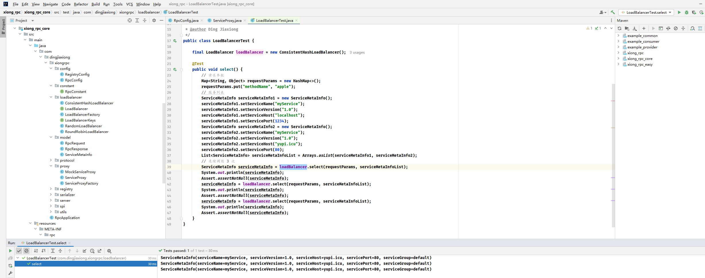


###### 2. 测试负载均衡调用


首先在不同的端口启动2个服务提供者，然后启动服务消费者项目，通过Debug或者控制台输出来观察每次请求的节点地址。


那就8887 和 8888 一样来一个


现在的消费者也是有3 次调用的


第一次走的8887


这里加个打印，看看效果


没毛病，因为我没配置，所以默认是轮询


如果我配一个Hash


再试一次


好像没搞起


消费者这边也要配一下


这样每次都找的 8887


##### 3.8.5 扩展


- 实现更多不同算法的负载均衡器
- 自定义一致性Hash算法中的Hash算法


#### 3.9 重试机制


##### 3.9.1 需求分析


目前，如果使用RPC框架的服务消费者调用接口失败，就会直接报错。

调用接口失败可能有很多原因，有时可是服务提供者返回了错误，但有时可能只是网络不稳定或服务提供者重启等临时性问题。这种情况下，我们可能更希望服务消费者拥有自动重试的能力，提高系统的可用性。


##### 3.9.2 设计方案


###### 重试机制


重试的概念我相信大家都理解，不必多说，就是“不行再来”呗。

我们需要掌握的是"如何设计重试机制”，重试机制的核心是重试策略，一般来说，包含以下几个考虑点：

1. 什么时候、什么条件下重试？
2. 重试时间（确定下一次的重试时间）
3. 什么时候、什么条件下停止重试？
4. 重试后要做什么？


**重试条件**


首先是什么时候、什么条件下重试？

这个比较好思考，如果我们希望提高系统的可用性，当由于网络等异常情况发生时，触发重试。


**重试时间**


重试时间（也叫重试等待）的策略就比较丰富了，可能会用到一些算法，主流的重试时间算法有：

- 固定重试间隔(Fiⅸed Retry Interval)：在每次重试，之间使用固定的时间间隔
- 指数退避重试(Exponential Backoff Retry)：在每次失败后，重试的时间间隔会以指数级增加，以避免请求过于密集。
- 随机延迟重试(Random Delay Retry)：在每次重试，之间使用随机的时间间隔，以避免请求的同时发生。
- 可变延迟重试(Variable Delay Retry)：这种策咯更“高级”了，根据先前重试的成功或失败情况，动态调整下一次重试的延迟时间。比如，根据前一次的响应时间调整下一次重试的等待时间。


值得一提的是，以上的策略是可以组合使用的，一定要根据具体情沉和需求灵活调整。比如可以先使用指数退避重试策略，如果连续多次重试失败，则切换到固定重试间隔策略。


**停止重试**


一般来说，重试次数是有上限的，否则随着报错的增多，系统同时发生的重试也会越来越多，造成雪崩。

主流的停止重试策略有：

- 最大尝试次数：一般重试当达到最大次数时不再重试。
- 超时停止：重试达到最大时间的时候，停止重试。


**重试工作**


最后一点是重试后要做什么事情？一般来说就是重复执行原本要做的操作，比如发送请求失败了，那就再发一次请求。

需要注意的是，当重试次数超过上限时，往往还要进行其他的操作，比如：

1. 通知告警：让开发者人工介入
2. 降级容错：改为调用其他接口、或者执行其他操作


###### 重试方案设计


回归到我们的RPC框架，消费者发起调用的代码如下：


我们完全可以将VertxTcpClient.doRequest封装为一个可重试的任务，如果请求失败（重试条件），系统就会自动按照重试策咯再次发起请求，不用开发者关心.


和序列化器、注册中心、负载均衡器一样，重试策略本身也可以使用`SPI`+工厂的方式，允许开发者动态配置和扩展自己的重试策略。

最后，如果重试超过一定次数，我们就停止重试，并且抛出异常。


##### 3.9.3 开发实现


###### 1. 多种重试策略实现


在RPC项目中新建fault.retry包，将所有重试相关的代码放到该包下。


[1] 先编写重试策略通用接口。提供一个重试方法，接受一个具体的任务参数，可以使用Callable类代表一个任务。

代码如下：


[2] 引入Guava-Retrying重试库，代码如下：


这个包还挺 ...


[3] 不重试策略实现。

就是直接执行一次任务，代码如下：


[4] 固定重试间隔策略实现。

使用Guava-Retrying提供的RetryerBuilder 能够很方便地指定重试条件、重试等待策略、重试停止策略、重试工作等。

代码如下：


上述代码中，重试策略如下：

- 重试条件：使用retrylfExceptionOfType方法指定当出现Exception异常时重试。
- 重试等待策略：使用withWaitStrategy方法指定策略，选择fixedWait固定时间间隔策略。
- 重试停止策略：使用withStopStrategy方法指定策略，选择stopAfterAttempt超过最大重试次数停止。
- 重试工作：使用withRetryListener监听重试，每次重试时，除了再次执行任务外，还能够打印当前的重试次数。


[5] 可以简单编写一个单元测试，来验证不同的重试策略，这是最好的学习方式。

单元测试代码如下：


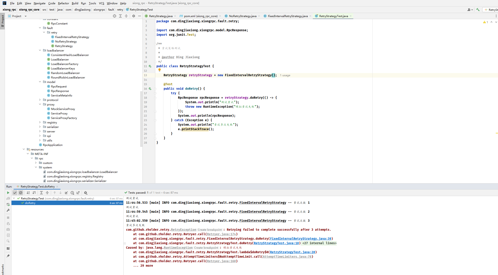


###### 2. 支持配置和扩展重试策略


一个成熟的RPC框架可会支持多种不同的重试策略，像序列化器、注册中心、负载均衡器一样，我们的需求是，让开发者能够填写配置来指定使用的重试策略，并且支持自定义重试策略，让框架更易用、更利于扩展。

要实现这点，开发方式和序列化器、注册中心、负载均衡器都是一样的，都可以使用工厂创建对象、使用`SPI`动态加载自定义的注册中心。

[1] 重试策略常量。

在fault.retry包下新建RetryStrategyKeys类，列举所有支持的重试策略键名。

代码如下：


[2] 使用工厂模式，支持根据key从`SPI`获取重试策略对象实例。

在fault.retry包下新建RetryStrategyFactory类，代码如下：


这个类可以直接复制之前的SerializerFactory,然后略做修改。可以发现，只要跑通了一次SPI机制，后续的开发就很简单了~

[3] 在META-INF的rpc/system目录下编写重试策略接口的SPl配置文件，文件名称为`com.dingjiaxiong.xiongrpc.fault.retry.RetryStrategy`

如图：


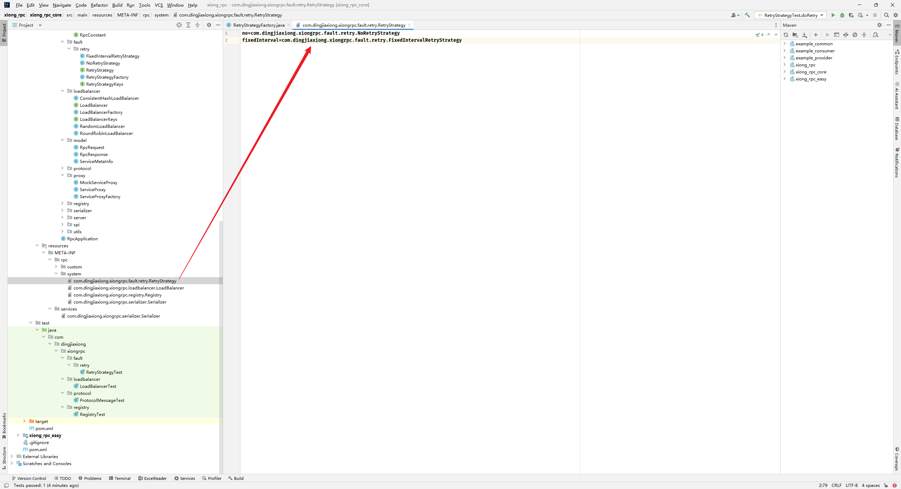


```
no=com.dingjiaxiong.xiongrpc.fault.retry.NoRetryStrategy
fixedInterval=com.dingjiaxiong.xiongrpc.fault.retry.FixedIntervalRetryStrategy
```


[4] 为RpcConfig全局配置新增重试策略的配置，代码如下：


默认是不重试


###### 3. 应用重试功能


现在，我们就能够愉快地使用重试功能了。修改ServiceProxy的代码，从工厂中获取重试器，并且将请求代码封装为一个Callable接口，作为重试器的参数，调用重试器即可。

修改的代码如下：

上述代码中，使用Lambda表达式将VertxTcpClient.doRequest封装为了一个匿名函数，简化了代码。

修改后的ServiceProxy的完整代码如下：


我们会发现，即使引入了重试机制，整段代码并没有变得更复杂，这就是可扩展性设计的巧妙之处。


##### 3.9.4 测试


首先启动服务提供者，然后使用Debug模式启动服务消费者，当服务消费者发起调用时，立刻停止服务提供者，就会看到调用失败后重试的情况。


配置一下啊


试试


消费者卡在这儿


即将调用


感觉是手慢了


强制整个异常？ 而且整个过程正常也会打印重试次数的日志。


这个位置也不太对 ， 异常被捕获了，请求还是正常下去了


##### 3.9.5 扩展


- 新增更多不同类型的重试器


#### 3.10 容错机制


##### 3.10.1 需求分析


我们已经给RPC框架增加了重试机制，提升了服务消费端的可靠性和健壮性。

但如果重试超过了一定次数仍然失败，我们又该怎么处理呢？

或者说当调用出现失败时，我们一定要重试么？有没有其他的策略呢


##### 3.10.2 设计方案


###### 容错机制

容错是指系统在出现异常情况时，可以通过一定的策略保证系统仍然稳定运行，从而提高系统的可靠性和健壮性。

在分布式系统中，容措机制尤为重要，因为分布式系统中的各个组件都可能存在网络故障、节点故障等各种异常情况。要顾全大局，尽可消除偶发/单点故障对系统带来的整体影响。

打个比方，将分布式系统类比为一家公司，如果公司某个优秀员工请假了，需要“触发容错”，让另一个普通员工顶上，这本质上是容错机制的一种降级策略。

容错机制一般都是在系统出现错误时才触发的，这点没什么好讲的，我们需要重点学习的是容错策略和容错实现方式。


**容错策略**


容错策略有很多种，常用的容错策略主要是以下几个：

- Fail-Over故障转移：一次调用失败后，切换一个其他节点再次进行调用，也算是一种重试。
- Fail-Back失败自动恢复：系统的某个功出现调用失败或错误时，通过其他的方法，恢复该功能的正常。可以理解为降级，比如重试、调用其他服务等。
- Fail-Safe静默处理：系统出现部分非重要功的异常时，直接忽略掉，不做任何处理，就像错误没有发生过一样。
- Fail-Fast快速失败：系统出现调用错误时，立刻报错，交给外层调用方处理。


**容错实现方式**


容错其实是个比较广泛的概念，除了上面几种策略外，很多技术都可以起到容错的作用。

比如：

1. 重试：重试本质上也是一种容错的降级策略，系统错误后再试一次。
2. 限流：当系统压力过大、已经出现部分错误时，通过限制执行操作（接受请求）的频率或数量，对系统进行保护。
3. 降级：系统出现错误后，改为执行其他更稳定可用的操作。也可以叫做“兜底”或"有损服务”，这种方式的本质是：即使牺性一定的服务质量，也要保证系统的部分功能可用，保证基本的功能需求得到满足。
4. 熔断：系统出现故障或异常时，暂时中断对该服务的请求，而是执行其他操作，以避免连锁故障。
5. 超时控制：如果请求或操作长时间没处理完成，就进行中断，防止阻塞和资源占用。


注意，在实际项目中，根据对系统可靠性的需求，我们通常会结合多种策略或方法实现容错机制。


###### 容错方案设计


回归到我们的RPC框架，之前已经给系统增加重试机制了，算是实现了一部分的容错能力。

现在，我们可以正式引入容错机制，通过更多策略来进一步增加系统可靠性。

容错方案的设计可以是很灵活的，建议大家先自己思考。

这里鱼皮提供2种方案：

1. 先容错再重试。
   当系统发生异常时，首先会触发容错机制，比如记录日志、进行告警等，然后可以选择是否进行重试。
   这种方案其实是把重试当故容错机制的一种可选方案。
2. 先重试再容错。在发生错误后，首先尝试重试操作，如果重试多次仍然失败，则触发容错机制，比如记录日志、进行告警等。


但其实大家能不能想到，这2种方案其实完全可以结合使用！

系统错误时，先通过重试操作解决一些临时性的异常，比如网络波动、服务端临时不可用等：如果重试多次后仍然失败，说明可能存在更严重的问题，这时可以触发其他的容措策略，比如调用降级服务、熔断、限流、快速失败等，来减少异常的影响，保障系统的稳定性和可靠性。

举个具体的例子：

1. 系统调用服务A出现网络错误，使用容错策略-重试。
2. 重试3次失败后，使用其他容错策略-降级。
3. 系统改为调用不依赖网络的服务B,完成操作


##### 3.10.3 开发实现


###### 1. 多种容错策略实现


在RPC项目中新建fault.tolerant包，将所有容错相关的代码放到该包下。


[1] 先编写容措策略通用接口。提供一个容措方法，使用Map类型的参数接受上下文信息（可用于灵活地传递容措处理需要用到的数据），并且接受一个具体的异常类参数。

由于容错是应用到发送请求操作的，所以容错方法的返回值是RpcResponse(响应)。

代码如下：


[2] 快速失败容错策略实现。

很好理解，就是遇到异常后，将异常再次抛出，交给外层处理。

代码如下：


[3] 静默处理容错策略实现。

也很好理解，就是遇到异常后，记己录一条日志，然后正常返回一个响应对象，就好像没有出现过报措。

代码如下：


[4] 其他容错策略。

还可以自行实现更多的容错策略，比如FailBackTolerantStrategy故障恢复策略：


还有FailOverTolerantStrategy故障转移策略：


当前的容错机制目录如下：


###### 2. 支持配置和扩展容错策略


一个成熟的RPC框架可能会支持多种不同的容错策略，像序列化器、注册中心、负载均衡器一样，我们的需求是，让开发者能够填写配置来指定使用的容错策略，并且支持自定义容错策略，让框架更易用、更利于扩展。

要实现这点，开发方式和序列化器、注册中心、负载均衡器都是一样的，都可以使用工厂创建对象、使用`SPI`动态动加载自定义的注册中心。


[1] 容错策略常量。
在fault.tolerant包下新建TolerantStrategyKeys类，列举所有支持的容错策略键名。

代码如下：


[2] 使用工厂模式，支特根据ky从SPI获取容错第略对象实例。

在fault.tolerant包下新建TolerantStrategyFactory类，代码如下：


这个类可以直接复制之前的SerializerFactory,然后略做修改。可以发现，只要跑通了一次SPI机制，后续的开发就很简单了~ 【好好好，又又】

[3] 在META-INF的rpc/system目录下编写容措策略接口的SPl配置文件，文件名称为`com.dingjiaxiong.xiongrpc.fault.tolerant.Tolerantstrategy`

如图：


[4] 为RpcConfig全局配置新增容错策略的配置，代码如下：


###### 3. 应用容错功能


容错功的应用非常简单，我们只需要修改ServiceProxy的部分代码，在重试多次抛出异常时，从工厂中获取容错策略并执行即可。

修改的代码如下：修改后的ServiceProxy的完整代码如下：


我们会发现，即使引入了容错机制，整段代码并没有变得更复杂，这就是可扩展性设计的巧妙之处。


##### 3.10.4 测试


首先启动服务提供者，然后使用Debug模式启动服务消费者，当服务消费者发起调用时，立刻停止服务提供者，就会看到调用失败后重试的情沉。等待多次重试后，就可以看到容错策咯的执行。


这里多半又不好测试，没懂这个发起调用是在哪儿，我都是一停就连接不上了


但是改完代码，在服务正常的情况下，还是可以正常调用提供者给的服务


按理说获取服务就在这个地方


##### 3.10.5 扩展


- 实现Fail-Back 容错机制
- 实现Fail-Over 容错机制
- 实现更多容错方案


#### 3.11 启动机制和注册驱动


##### 3.11.1 需求分析


回归到我们的RPC项目，其实框架目前是不够易用的。还记得么？光是我们的示例服务提供者，就要写下面这段又臭又长的代码！


本节教程，我们就来优化框架的易用性，通过建立合适的启动机制和注解驱动机制，帮助开发者最少只用一行代码，就能轻松使用框架！


##### 3.11.2 设计方案


###### 启动机制设计


其实很简单，把所有启动代码封装成一个专门的启动类或方法，然后由服务提供者/服务消费者调用即可。
但有一点我们需要注意，服务提供者和服务消费者需要初始化的模块是不同的，比如服务消费者不需要启动Wb服务器。

所以我们需要针对服务提供者和消费者分别编写一个启动类，如果是二者都需要初始化的模块，可以放到全局应用类`RpcApplication`中，复用代码的同时保证启动类的可维护、可扩展性。


###### 注解驱动设计


除了启动类外，其实还有一种更牛的方法，能帮助开发者使用框架。

它的做法是注解区动，开发者只需要在服务提供者实现类打上一个DubboService注解，就快速注册服务；同样的，只要在服务消费者字段打上一个`DubboReference`注解，就快速使用服务。


由于现在的Java项目基本都使用Spring Boot框架，所以Dubbo还贴心地推出了Spring Boot Starter,用更少的代码在Spring Boot项目中使用框架。

那我们也可以有样学样，创建一个Spring Boot Starter项目，并通过注解区动框架的初始化，完成服务注册和获取引用。


##### 3.11.3 开发实现


###### 启动机制

我们在rpc项目中新建包名bootstrap,所有和框架启动初始化相关的代码都放到该包下。


**服务提供者启动类**


新建ProviderBootstrap类，先直接复制之前服务提供者示例项目中的初始化代码，然后略微改造，支持用户传入自己要注册的服务。


改造啊


在注册服务时，我们需要填入多个字段，比如服务名称、服务实现类，参考代码如下：


我们可以将这些字段进行封装，在model包下新建ServiceRegisterInfo类，代码如下：


这样一来，服务提供者的初始化方法只需要接受封装的注册信息列表作为参数即可，简化了方法。

服务提供者完整代码如下：


现在，我们想要在服务提供者项目中使用RPC框架，就非常简单了。只需要定义要注册的服务列表，然后一行代码调用ProviderBootstrap.init方法即可完成初始化。

示例代码如下：


**服务消费者启动类**


服务消费者启动类的实现就更简单了，因为它不需要注册服务、也不需要启动Web服务器，只需要执行`RpcApplication.init`完成框架的通用初始化即可。

服务消费者启动类的完整代码如下：


目前的项目结构如图：


服务消费者示例项目的代码不会有明显的变化，只不过改为调用启动类了。

示例代码如下：


###### Spring Boot Starter 注解驱动


注意，为了便于大家学习，不要和已有项目的代码混淆，我们再来创建一个新的项目模块，专门用于实现Spring Boot Starter注解驱动的RPC框架。

Dubbo是在框架内引入了spring-context,会让整个框架更内聚，但是不利于学习理解。


**1. Spring Boot Starter 项目初始化**


在项目根目录处右键新建模块：


选择`Spring Initializr`,将Server URL更改为`start.aliyun.com`,然后创建一个名为`xiong_rpc_spring_boot_starter`的模块，JDK和Java版本选择`>=8`

如下图：


选择Spring Boot版本为2.6，项目依赖如下：


马德，搞错了，干成gradle 了


OK了


创建好模块后，修改pom.xml文件，移除无用的插件代码：


这一块干掉


留这一个就行

引入我们开发的RPC框架：


至此，Spring Boot Starter项目已经完成初始化。


**2. 定义注解**


实现注解区动的第一步是定义注解，要定义哪些注解呢？我们怎么知道应该定义哪些注解呢？

还是那句话，有样学样，可以参考知名框架Dubbo的注解。


比如：

1. @EnableDubbo:在Spring Boot主应用类上使用，用于启用Dubbo功能。
2. @DubboComponentScan:在Spring Boot主应用类上使用，用于指定Dubbo组件扫描的包路径。
3. @DubboReference:在消费者中使用，用于声明Dubbo服务l用。
4. @DubboService:在提供者中使用，用于声明Dubbo服务。
5. @DubboMethod:在提供者和消费者中使用，用于配置Dubbo方法的参数、超时时间等。
6. @DubboTransported:在Dubbo提供者和消费者中使用，用于指定传输协议和参数，例如传输协议的类型、端口等。


当然，这些注解我们不需要全部用到，遵循最小可用化原则，我们只需要定义3个注解。

在`xiong_rpc_spring_boot_tarter`项目下新建annotation包，将所有注解代码放到该包下。


如下图：


[1] `@EnableRpc`:用于全局标识项目需要引入RPC框架、执行初始化方法。
由于服务消费者和服务提供者初始化的模块不同，我们需要在EnableRpc注解中，指定是否需要启动服务器等属性。

代码如下：


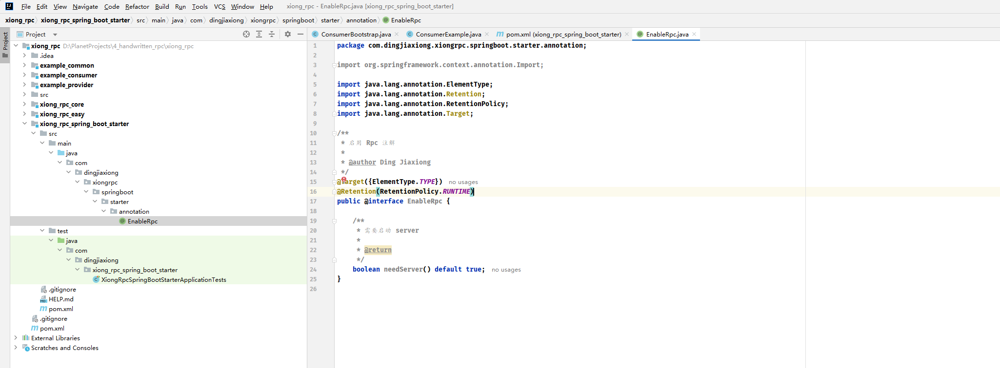


当然，你也可以将EnableRpc注解拆分为两个注解（比如EnableRpcProvider、.EnableRpcConsumer),分别用于标识服务提供者和消费者，但可能存在模块重复初始化的可性，


[2 ] `@RpcService` :服务提供者注解，在需要注册和提供的服务类上使用。

RpcService注解中，需要指定服务注册信息属性，比如服务接口实现类、版本号等（也可以包括服务名称）。

代码如下：


[3] `@RpcReference` :服务消费者注解，在需要注入服务代理对象的属性上使用，类似Spring中的@Resource注解。

RpcReference注解中，需要指定调用服务相关的属性，比如服务接口类（可能存在多个接口）、版本号、负载均衡器、重试策略、是否Mock模拟调用等。

代码如下：


**3. 注解驱动**


在starter项目中新建bootstrap 包，并且分别针对上面定义的3个注解新建启动类。

项目的目录结构如图：


[1] Rpc框架全局启动类RpcInitBootstrap。

我们的需求是，在Spring框架初始化时，获取@EnableRpc注解的属性，并初始化RPC框架。

怎么获取到注解的属性呢？

可以实现Spring的ImportBeanDefinitionRegistrar接口，并且在registerBeanDefinitions方法中，获取到项目的注解和注解属性。


完整代码如下：


> 这里那个日志还是要自己引，因为core 里面设置了作用域的，就算引了core，但是用不了


上述代码中，我们从Spring元信息中获取到了EnableRpc注解的needServer属性，并通过它来判断是否要启动服务器。


[2] RpC服务提供者启动类RpcProviderBootstrap。

服务提供者启动类的作用是，获取到所有包含@pcService注解的类，并且通过注解的属性和反射机制，获取到要注册的服务信息，并且完成服务注册。

怎么获取到所有包含@RpcService注解的类呢？

像前面设计方案中提到的，可以主动扫描包，也可以利用Spring的特性监听Bean的加载。

此处我们选泽后者，实现更简单，而且能直接获取到服务提供者类的Bean对象。

只需要让启动类实现BeanPostProcessor接口的postProcessAfterInitialization方法，就可以在某个服务提供者Bean初始化后，执行注册服务等操作了。

完整代码如下：


其实上述代码中，绝大多数服务提供者初始化的代码都只需要从之前写好的启动类中复制粘贴，只不过换了一种参数获取方式罢了。


[3] Rpc服务消费者启动类RpcConsumerBootstrap。

和服务提供者启动类的实现方式类似，在Bean初始化后，通过反射获取到Bean的所有属性，如果属性包含@RpcReference注解，那么就为该属性动态生成代理对象并赋值。

完整代码如下：


上述代码中，核心方法是`beanclass,getDeclaredFields`,用于获取类中的所有属性。看到这里的同学，必须要把反射的常用语法熟记于心了。


[4] 注册已编写的启动类。

最后，别忘了在Spring中加载我们已经编写好的启动类。

如何加载呢？

我们的需求是，仅在用户使用@EnableRpc注解时，才启动RPC框架。所以，可以通过给EnableRpc增加@Import注解，来注册我们自定义的启动类，实现灵活的可选加载。

修改后的EnableRpc注解代码如下：


至此，一个基于注解码驱动的RPC框架Starter开发完成。 666


##### 3.11.4 测试


让我们使用IDEA新建2个使用Spring Boot 2框架的项目。

- 示例Spring Boot消费者：`example_springboot_consumer`

  

- 示例Spring Boot提供者：`example_springboot_provider`

  


啥依赖都没勾


项目的目录结构如下图：


每个项目都引入依赖：


[1] 示例服务提供者项目的入口类加上@EnableRpc注解，代码如下：


服务提供者提供一个简单的服务，代码如下：


[2] 示例服务消费者的入口类加上@EnableRpc(needServer=false)注解，标识启动RPC框架，但不启动服务器。

代码如下：


消费者编写一个Spring的Bean,引入UserService属性并打上@RpcReference注解，表示需要使用远程服务提供者的服务。

代码如下：


服务消费者编写单元测试，验证否调用远程服务：


[3] 启动服务提供者入口类，如下图：


启动服务消费者的入口类，如下图：


可以看到server并没有启动，符合预期。

最后，执行服务消费者的单元测试，验证否跑通整个流程。

如下图，调用成功：


服务提供者也收到了调用：


至此，我们就够通过使用注解的方式，轻松地给项目引入RPC框架了~，6666


##### 3.11.5 扩展


- Spring Boot Starter项目支特读取yml/yaml配置文件来启动RPC框架。


#### 3.12 扩展思路


- RPC请求类中支持携带参数列表，可用于安全校验等。
- 开发服务管理界面
- 项目支持读取yml/yaml等更多类型的配置文件，作为全局配置。
- 实现拦截器机制，服务调用前和服务调用后可以执行额外的操作。
- 自定义异常
- 服务支持指定版本号
- 支持消费方指定某个服务级别的负载均衡器、重试策略、容错机制。
- 支持指定服务分组：服务提供者能够选择服务的分组，服务消费者够使用指定分组的服务。(Dubbo支持)
- 服务消费方支持设定超时时间。
- 处理Bean注入问题：目前本地服务注册表存储的是class,然后通过反射创建实例，但是如果Ban包含有参构造函数，或者给属性注入了其他示例，这种方式就行不通了。
- 压力测试RPC框架的性能。
- 服务注册信息缓存优化，支持区分服务key,而不是公用同一个缓存对象。参考思路：目前的缓存实现是最简单的，但如果有多个服务，可能会冲突，可以使用Map等结构维护多个缓存信息
- 服务注册信息缓存增加过期时间，定期刷新缓存。参考思路：使用Caffeine构建缓存。


哇，太离谱了。


